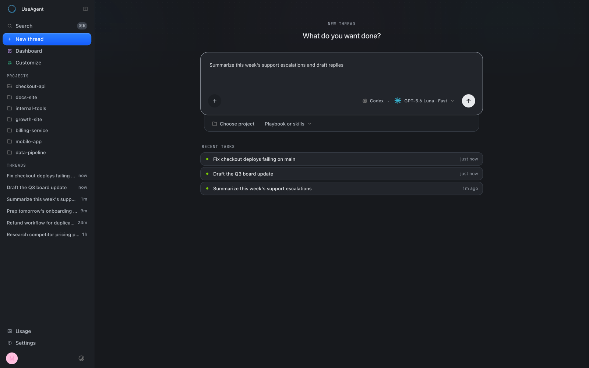
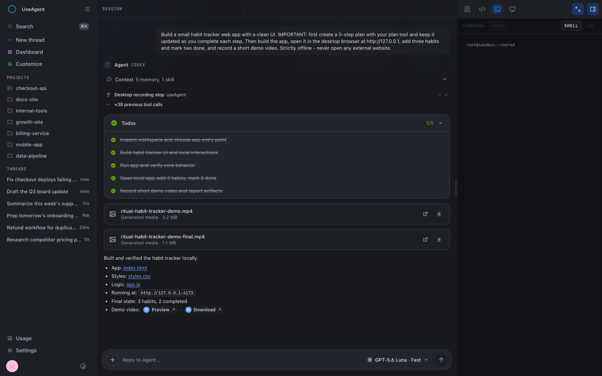

<h1 align="center">useAgent</h1>

<p align="center">
  <b>Hand off the work. Get back the result.</b><br>
  The open-source AI coworker for your team.
</p>

<p align="center">
  <a href="https://github.com/useagenthq/useagent/releases"></a>
  <a href="LICENSE"></a>
  <a href="https://bun.sh"></a>
  <a href="https://useagent.org/docs/"></a>
</p>

<p align="center">
  <a href="#quick-start"><b>Quick Start</b></a> ·
  <a href="#self-hosting"><b>Self-hosting</b></a> ·
  <a href="https://useagent.org/docs/"><b>Documentation</b></a> ·
  <a href="#architecture"><b>Architecture</b></a>
</p>

---

<p align="center">
  
</p>

<p align="center">
  
</p>

> **Alpha software.** useAgent is under active development: expect rough edges,
> and APIs/schemas may change between releases. It already runs real daily
> workloads, but pin a tag if you need stability.

useAgent turns the AI agents you already use - Claude Code, Codex, OpenCode -
into coworkers with their own cloud computer, your tools, and your company
context. They hand back finished work, not just answers: live websites, decks,
spreadsheets, research reports, and tested pull requests.

Under the hood: durable, threaded sessions in isolated Linux sandboxes. One
event contract, one UI, your infrastructure.

Every run is an event-sourced timeline in Postgres: it survives restarts,
renders through one session grammar regardless of engine, and stays
inspectable after the fact.

## Features

- **Any agent, one interface** - Codex (API key or ChatGPT subscription),
  Claude Code, and OpenCode behind one provider-neutral event contract.
- **Durable runs** - runs survive backend restarts; recovery re-probes live
  sessions and adopts finished work instead of failing it.
- **Real sandboxes** - each thread gets an isolated Linux workstation:
  terminal, repositories, browser, and a visible desktop (noVNC) with MP4
  recording. Daytona and Cube behind one sandbox contract.
- **Trusted gateway** - credentials never enter the sandbox; knowledge,
  memory, skills, GitHub, web search, desktop control, and artifact publishing
  are typed tools served by the backend.
- **Human-in-the-loop** - destructive tools pause on an approval card (web or
  Slack) and resume with a one-shot, argument-bound capability.
- **Skills from GitHub** - import `SKILL.md` files as versioned skills,
  auto-resync, and rank them into every turn.
- **Knowledge, wiki, and team memory** - org-scoped retrieval with citations
  and a human-reviewed learning lane.
- **Slack-native** - mention-to-run, threaded replies, attachments, artifacts,
  and approvals in the thread.
- **Native artifacts** - DOCX, XLSX, PPTX, and PDF with revisioned editing and
  native renderers.

## Quick Start

Requires [bun](https://bun.sh) and Postgres 16+ with the
[pgvector](https://github.com/pgvector/pgvector) extension (stock Postgres
images do not include it). No Postgres handy? One container does it:

```bash
docker run -d --name useagent-pg -p 5432:5432   -e POSTGRES_HOST_AUTH_METHOD=trust pgvector/pgvector:pg16
export DATABASE_URL=postgres://postgres@localhost:5432/postgres
```

```bash
for workspace in \
  packages/agent-harness packages/artifact-workspace \
  packages/agent-client packages/artifact-formats packages/conformance \
  backend frontend; do
  (cd "$workspace" && bun install)
done

bun run dev:backend    # API + orchestration on :3201
bun run dev:frontend   # UI on :3400 (proxies /api/* to the backend)
```

`bun run typecheck` covers every package.

## Self-hosting

useAgent runs on **any Linux host** - AWS, Google Cloud, Azure, Hetzner, or
bare metal. See [`infra/self-host/`](infra/self-host/README.md) for the full
guide, including the one-command Hetzner reference host (Terraform) and the
provider-agnostic [`deploy-app.sh`](infra/self-host/deploy-app.sh):

```bash
SERVER_IP=<host-ip> PG_PASSWORD=... OPENROUTER_API_KEY=... \
  infra/self-host/deploy-app.sh /path/to/this/repo
```

Sandboxes are pluggable: **Daytona** (managed service - pairs with a host on
any cloud, easiest start) or **CubeSandbox** (self-hosted runtime on your own
hardware - full data locality). Production deploy lanes are documented in
[`infra/self-host/`](infra/self-host/); the provisioning is provider-agnostic
and addresses the host over SSH.

## Architecture

```
frontend (Next.js)  ->  backend (Bun + Hono + Postgres)  ->  sandboxes (Daytona/Cube)
        UI renders the event log        event-sourced runs,          isolated Linux
        never a live process            trusted tool gateway         workstations
```

| Path | What it owns |
|---|---|
| [`frontend/`](frontend/README.md) | Product UI: chat, sessions, skills, playbooks, wiki, artifacts, automations, settings |
| [`backend/`](backend/README.md) | Control plane: auth, runs, sandboxes, engines, knowledge, memory, artifacts, connectors |
| [`packages/`](packages/) | Shared contracts: thread events, canonical engine events, workpieces, renderers |
| [`docs-site/`](docs-site/README.md) | Documentation site: concepts, architecture, API, operations |
| [`infra/self-host/`](infra/self-host/README.md) | Self-hosting on any provider + Hetzner reference Terraform |
| [`memory/`](memory/README.md) | Optional team-memory service |

Deeper reading: the [documentation site](https://useagent.org/docs/) and the interactive
[request-flow diagram](docs/architecture/request-flow.html).

The additive immutable-container release lane is documented in
[`docs/operations/immutable-releases.md`](docs/operations/immutable-releases.md).

## License

useAgent is free and open-source software under the
[GNU AGPL v3.0](LICENSE) (AGPL-3.0-only). You may use, modify, and
self-host useAgent under the AGPL.

If you want to embed useAgent into proprietary software, distribute it
without AGPL obligations, build an OEM or white-label product, or obtain
different terms, a [commercial license](COMMERCIAL-LICENSE.md) is
available.

Contributions are accepted under the [CLA](CLA.md). The useAgent name and
logo are covered by the [trademark policy](TRADEMARKS.md), not the code
license. Third-party components are listed in [NOTICE](NOTICE); vendored
and ported files carry per-file attribution headers.
