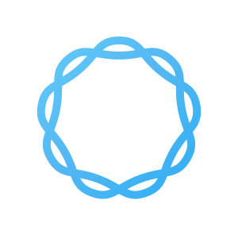
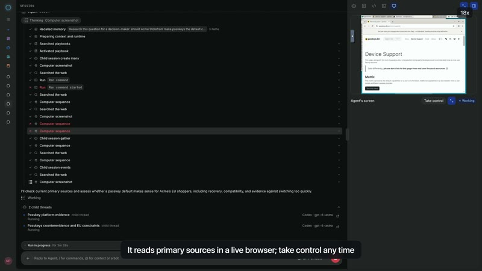
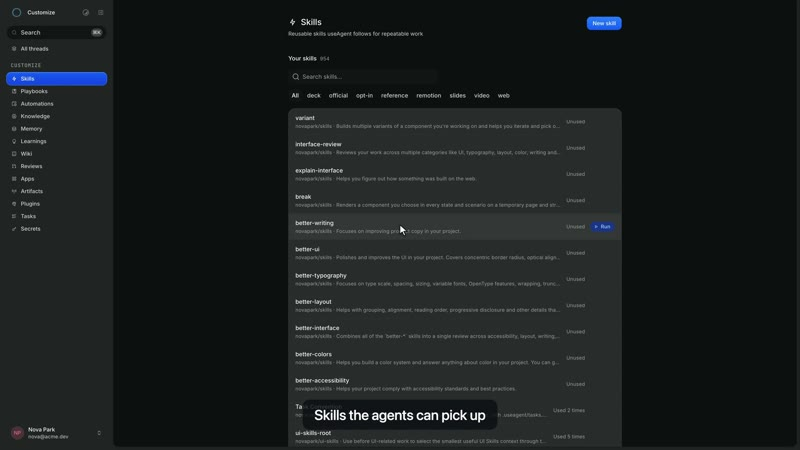
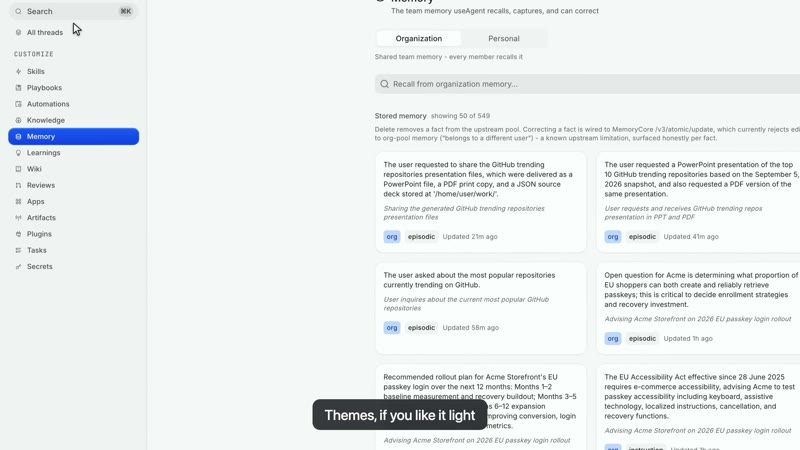
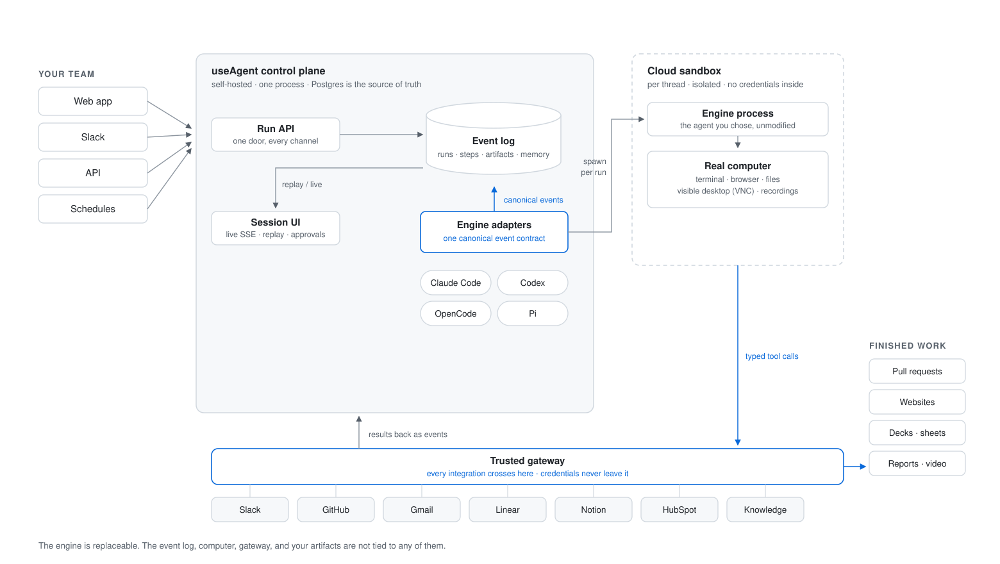

<h1 align="center">
   useAgent
</h1>

<p align="center">
  <strong>The open-source AI coworker for your team.</strong><br>
  Your agents. Their own computer. Finished work you can use.
</p>

<p align="center">
  <a href="https://github.com/useagenthq/useagent/releases"></a>
  <a href="LICENSE"></a>
  <a href="https://bun.sh"></a>
  <a href="https://useagent.org/docs/"></a>
</p>

<p align="center">
  <a href="https://useagent.org/#demo"><b>Watch the demo</b></a> ·
  <a href="#quick-start"><b>Quick Start</b></a> ·
  <a href="#self-hosting"><b>Self-hosting</b></a> ·
  <a href="https://useagent.org/docs/"><b>Documentation</b></a> ·
  <a href="#architecture"><b>Architecture</b></a>
</p>

useAgent gives Claude Code, Codex, OpenCode, and Pi a shared workspace with
repositories, a terminal, a browser, and your team's tools and context. Ask for
research, a website, a spreadsheet, or a code change. Follow the work in the
thread, step in when needed, and open the files it produces.

<p align="center">
  <a href="https://useagent.org/#demo">
    
  </a>
</p>

<p align="center">
  <a href="https://useagent.org/#demo"><b>Watch the 63-second product tour →</b></a><br>
  <sub>Real product footage. No sign-in required. The recorded UI may differ from your release.</sub>
</p>

> **Alpha software.** useAgent is under active development: expect rough edges,
> and APIs/schemas may change between releases. It already runs real daily
> workloads, but pin a tag if you need stability.

## Features

<!-- Demo excerpts: https://useagent.org/demos/main-demo-63s.mp4
     computer 11-17s; skills 51.4-55.4s; memory 56-60.5s.
     800px, 8fps GIFs with JPEG fallbacks. Edited footage, not a speed benchmark. -->

<table>
<tr>
<td width="45%" valign="middle">

### A computer for every thread

Watch an agent research in a real browser, run commands, and work with your
repositories. Open its desktop or terminal and take control when you need to.
Daytona and CubeSandbox provide isolated Linux workstations with screen recording.

[Computer use and sandboxes →](https://useagent.org/docs/concepts/sandboxes-and-desktop/)

</td>
<td width="55%">
  <a href="https://useagent.org/docs/concepts/sandboxes-and-desktop/">
    <picture>
      <source media="(prefers-reduced-motion: reduce)" srcset="docs/media/demo-computer.jpg">
      <source srcset="docs/media/demo-computer.gif" type="image/gif">
      
    </picture>
  </a>
</td>
</tr>
<tr>
<td width="45%" valign="middle">

### Teach it how your team works

Import skills from GitHub, pin a playbook to a task, and reuse the procedures
that work. Skills are versioned, so a run records exactly what it used.

[Skills and playbooks →](https://useagent.org/docs/product/skills-and-playbooks/)

</td>
<td width="55%">
  <a href="https://useagent.org/docs/product/skills-and-playbooks/">
    <picture>
      <source media="(prefers-reduced-motion: reduce)" srcset="docs/media/demo-skills.jpg">
      <source srcset="docs/media/demo-skills.gif" type="image/gif">
      
    </picture>
  </a>
</td>
</tr>
<tr>
<td width="45%" valign="middle">

### Context that carries forward

Keep knowledge, wiki pages, and optional team memory beside the work. Inspect
recalled facts, correct them, and keep personal and organization memory separate.

[Knowledge and memory →](https://useagent.org/docs/concepts/knowledge-and-learning/)

</td>
<td width="55%">
  <a href="https://useagent.org/docs/concepts/knowledge-and-learning/">
    <picture>
      <source media="(prefers-reduced-motion: reduce)" srcset="docs/media/demo-memory.jpg">
      <source srcset="docs/media/demo-memory.gif" type="image/gif">
      
    </picture>
  </a>
</td>
</tr>
</table>

**Also in the workspace:**

- **[Files you can use](https://useagent.org/docs/product/artifacts/)** - documents,
  spreadsheets, presentations, PDFs, images, and videos. Supported workpieces
  have revisioned edits and native exports.
- **[Work from Slack](https://useagent.org/docs/channels/slack/)** - mention an
  agent, send attachments, and receive artifacts in the thread.
- **[Recurring work](https://useagent.org/docs/product/automations/)** - schedule
  tasks, inspect their history, or run one immediately.
- **[Approval controls](https://useagent.org/docs/concepts/gateway-tools-and-approvals/)** -
  gated tools pause for a decision and resume with a one-shot, argument-bound capability.
- **[Durable sessions](https://useagent.org/docs/concepts/events-and-streaming/)** -
  Postgres stores the event timeline; recovery re-probes live sessions after a restart.

## Supported agents

<p>
  <kbd>Claude Code</kbd> &nbsp; <kbd>Codex</kbd> &nbsp; <kbd>OpenCode</kbd> &nbsp; <kbd>Pi</kbd>
</p>

One session UI and event contract across engines. Connect a supported provider
account or API key; available models, login methods, and tools depend on the
adapter and your self-hosted configuration. See the [engine guide](https://useagent.org/docs/concepts/engines-and-adapters/).

## Integrations

Work arrives from anywhere and tools stay behind the gateway:

| Surface | What's connected |
|---|---|
| **Channels in** | Web app, Slack, REST API, schedules - every channel enters through the same run door |
| **Native** | Slack (mentions, threads, delivery), GitHub (App auth, clones, PRs) |
| **Via connectors** | Gmail, Linear, Notion, HubSpot - OAuth handled by the broker, tokens sealed server-side |
| **Workspace surfaces** | Knowledge base, team memory, skills and playbooks, scheduled automations |

## Quick Start

Clone the public repository:

```bash
git clone https://github.com/useagenthq/useagent.git
cd useagent
```

Requires [bun](https://bun.sh) and Postgres 16+ with the
[pgvector](https://github.com/pgvector/pgvector) extension (stock Postgres
images do not include it). No Postgres handy? One container does it:

```bash
docker run -d --name useagent-pg -p 127.0.0.1:5432:5432 \
  -e POSTGRES_HOST_AUTH_METHOD=trust pgvector/pgvector:pg16
export DATABASE_URL=postgres://postgres@localhost:5432/postgres
```

```bash
for workspace in \
  packages/agent-harness packages/artifact-workspace \
  packages/agent-client packages/artifact-formats packages/sandbox-contract \
  packages/conformance packages/cli \
  backend frontend; do
  (cd "$workspace" && bun install --frozen-lockfile)
done

bun run dev:backend    # API + orchestration on :3201
bun run dev:frontend   # UI on :3400 (proxies /api/* to the backend)
```

`bun run typecheck` covers every package.

The database example is for local development. See the
[setup guide](https://useagent.org/docs/getting-started/quickstart/) for provider
credentials and sandbox configuration before running a real agent task.

## Self-hosting

useAgent runs on **any Linux host** - AWS, Google Cloud, Azure, or
bare metal. See [`infra/self-host/`](infra/self-host/README.md) for the full
guide, including the one-command reference host (Terraform) and the
provider-agnostic [`deploy-app.sh`](infra/self-host/deploy-app.sh):

```bash
SERVER_IP=<host-ip> PG_PASSWORD=... OPENROUTER_API_KEY=... \
  infra/self-host/deploy-app.sh /path/to/this/repo
```

Sandboxes are pluggable: **Daytona** (managed service - pairs with a host on
any cloud, easiest start) or **CubeSandbox** (self-hosted runtime on your own
hardware - full data locality). Production deploy lanes are documented in
[`infra/self-host/`](infra/self-host/); the provisioning is provider-agnostic
and addresses the host over SSH.

## Architecture

<p align="center">
  
</p>

Three properties do the heavy lifting:

1. **The engine is a plug.** Claude Code, Codex, OpenCode, and Pi all speak one
   canonical event contract through the engine adapters - swap engines and your
   threads, artifacts, and memory stay.
2. **Every run is an event log.** Postgres is the source of truth: runs survive
   backend restarts, replay exactly, and stay inspectable after the fact.
3. **Credentials never enter the sandbox.** The agent's computer is isolated;
   every integration call crosses the trusted gateway as a typed tool, and the
   keys live only on your control plane.

| Path | What it owns |
|---|---|
| [`frontend/`](frontend/README.md) | Product UI: chat, sessions, skills, playbooks, wiki, artifacts, automations, settings |
| [`backend/`](backend/README.md) | Control plane: auth, runs, sandboxes, engines, knowledge, memory, artifacts, connectors |
| [`packages/`](packages/) | Shared contracts: thread events, canonical engine events, workpieces, renderers |
| [`docs-site/`](docs-site/README.md) | Documentation site: concepts, architecture, API, operations |
| [`infra/self-host/`](infra/self-host/README.md) | Self-hosting on any provider, with a reference Terraform host |
| [`memory/`](memory/README.md) | Optional team-memory service |

Deeper reading: the [documentation site](https://useagent.org/docs/) and the interactive
[request-flow diagram](docs/architecture/request-flow.html).

The additive immutable-container release lane is documented in
[`docs/operations/immutable-releases.md`](docs/operations/immutable-releases.md).

## Community and contributing

- [Report a bug or request a feature](https://github.com/useagenthq/useagent/issues).
- [Read the release notes](https://github.com/useagenthq/useagent/releases).
- Start with the [repository map](https://useagent.org/docs/getting-started/repository-map/)
  and the frontend or backend README when contributing.

## License

useAgent is free and open-source software under the
[GNU AGPL v3.0](LICENSE) (AGPL-3.0-only). You may use, modify, and
self-host useAgent under the AGPL.

If you want to embed useAgent into proprietary software, distribute it
without AGPL obligations, build an OEM or white-label product, or obtain
different terms, a [commercial license](COMMERCIAL-LICENSE.md) is
available.

Contributions are accepted under the [CLA](CLA.md). The useAgent name and
logo are covered by the [trademark policy](TRADEMARKS.md), not the code
license. Third-party components are listed in [NOTICE](NOTICE); vendored
and ported files carry per-file attribution headers.
