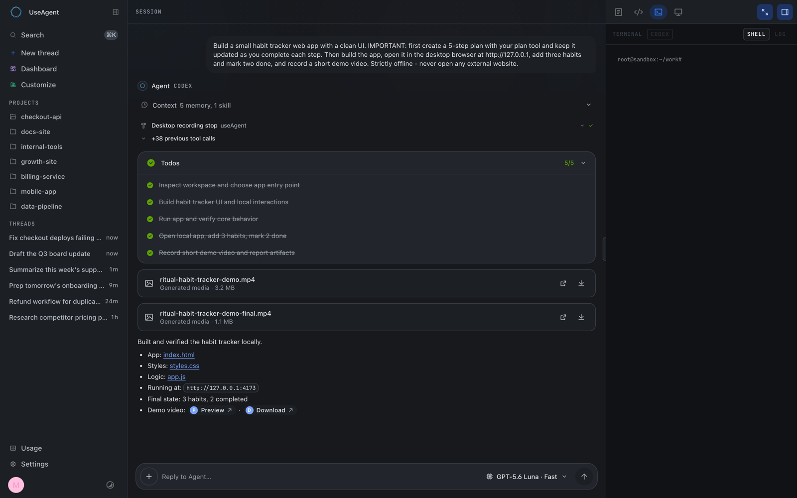
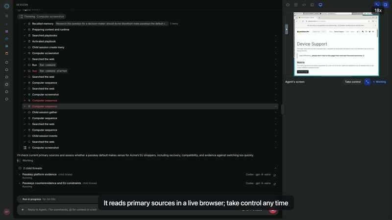
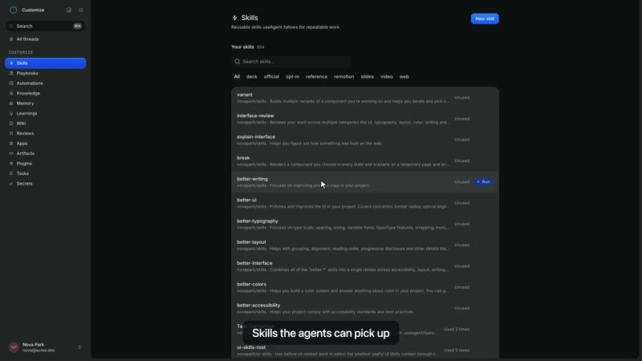
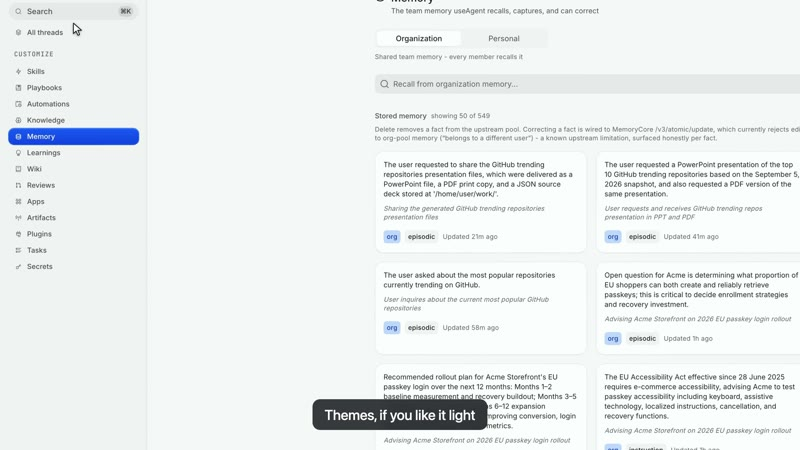
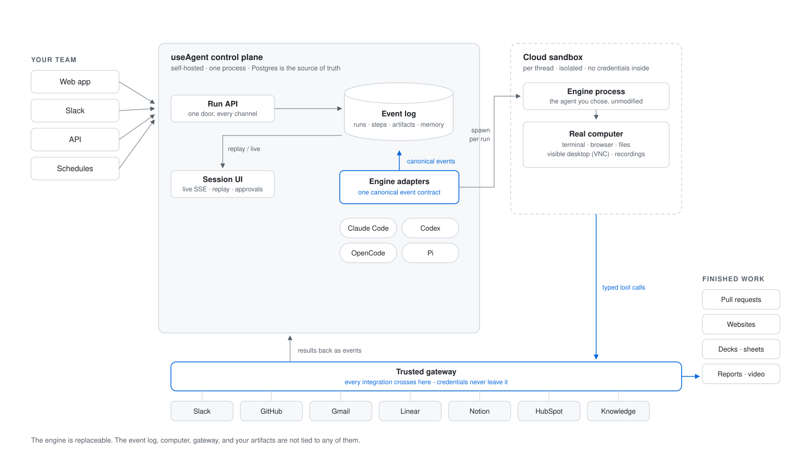

<h1 align="center">
   UseAgent
</h1>

<p align="center">
  <strong>The open-source Devin alternative.</strong><br>
  Run Claude Code, Codex, OpenCode or Pi in isolated cloud workspaces you can self-host.<br>
  Hand off work from Slack, the web or the API, and get pull requests and files back.
</p>

<p align="center">
  <a href="https://github.com/useagenthq/useagent/releases"></a>
  <a href="LICENSE"></a>
  <a href="https://github.com/useagenthq/useagent/stargazers"></a>
  <a href="https://github.com/useagenthq/useagent/issues?q=is%3Aopen+label%3Ahacktoberfest"></a>
  <a href="https://useagent.org/docs/"></a>
</p>

<p align="center">
  <a href="#use-the-hosted-app"><b>Try the hosted app</b></a> ·
  <a href="#self-hosting"><b>Self-host</b></a> ·
  <a href="https://useagent.org/#demo"><b>Watch the demo</b></a> ·
  <a href="https://useagent.org/docs/"><b>Docs</b></a> ·
  <a href="#hacktoberfest-2026"><b>Contribute</b></a>
</p>

<p align="center">
  <a href="docs/readme/README.es.md">Español</a> · <a href="docs/readme/README.zh-CN.md">简体中文</a> · <a href="docs/readme/README.hi.md">हिन्दी</a> · <a href="docs/readme/README.pt-BR.md">Português (BR)</a>
</p>

UseAgent gives Claude Code, Codex, OpenCode and Pi a shared workspace with
repositories, a terminal, a browser and your team's tools. Ask for research, a
website, a spreadsheet or a code change from the web app, Slack or the API.
Follow the work live, step in when you need to, and keep the files it makes.

<p align="center">
  <a href="https://useagent.org/#demo">
    
  </a>
</p>

<p align="center">
  <a href="https://useagent.org/#demo"><b>Watch the 63-second product tour →</b></a><br>
  <sub>Real product footage. No sign-in required.</sub>
</p>

## Why teams pick UseAgent

<table>
<tr>
<td width="50%" valign="top">

**It runs on your server.** Self-host the whole thing on any Linux box. Your
code, prompts and files stay where you put them, which is what compliance
teams ask for first.

</td>
<td width="50%" valign="top">

**Every run is on the record.** Postgres stores each step, tool call and
approval as an append-only log. Replay any run, see who approved what, and
survive a restart mid-task.

</td>
</tr>
<tr>
<td width="50%" valign="top">

**Use the accounts you already pay for.** Run Codex on your ChatGPT plan, or
bring API keys for any engine. Keys live on your server and never enter the
agent's sandbox.

</td>
<td width="50%" valign="top">

**Swap the agent, keep everything else.** Claude Code, Codex, OpenCode and Pi
share one event format, so threads, files and memory carry over when you
change engines.

</td>
</tr>
</table>

> **Alpha software.** UseAgent runs real daily workloads, but APIs and schemas
> can change between releases. Pin a tag if you need stability.

## UseAgent and Devin

| | Devin | UseAgent |
|---|---|---|
| Source code | Closed | Open source (AGPL) |
| Where it runs | Cognition's cloud; enterprise plans can put the workspace in your VPC, the agent itself stays in Cognition's cloud | All of it on our cloud, your own servers, or your laptop |
| Which agent | Devin's own | Claude Code, Codex, OpenCode or Pi, side by side |
| Model bill | Paid through Devin | Your own keys, your ChatGPT plan for Codex, or free models |
| Record of the work | In Devin's app | Every step in your own Postgres, replayable |

UseAgent is not a new model, and not a proven replacement for every Devin workflow. It is the workspace around the agents you already use: a computer per task, your team's tools and context, and a full record of what happened.

## Use the hosted app

No install, no credit card. Start here:

1. **Sign up** at [app.useagent.org](https://app.useagent.org) with your email.
2. **Start a thread** from the home page and say what you want done: a website,
   a research report, a spreadsheet, a fix in one of your repositories.
3. **Pick a model.** Free models are always available. Choose one from the
   Free list in the model menu and go.
4. **Bring the plan you already have.** Open **Settings → Provider connections**
   and connect your ChatGPT account to run Codex on your own plan. In India, the
   free ChatGPT Go plan works too.
5. **Add more models when you want them.** Paste an API key in the same place.
   Keys are write-only and never enter the agent's sandbox.

Watch the agent work in its browser and terminal, answer it when it asks, and
open the files it makes.

## Features

<!-- Demo excerpts: https://useagent.org/demos/main-demo-63s.mp4
     computer 11-17s; skills 51.4-55.4s; memory 56-60.5s.
     800px, 8fps GIFs with JPEG fallbacks. Edited footage, not a speed benchmark. -->

<table>
<tr>
<td width="45%" valign="middle">

### A computer for every thread

Watch an agent research in a real browser, run commands, and work with your
repositories. Open its desktop or terminal and take control when you need to.
Daytona and CubeSandbox provide isolated Linux workstations with screen recording.

[Computer use and sandboxes →](https://useagent.org/docs/concepts/sandboxes-and-desktop/)

</td>
<td width="55%">
  <a href="https://useagent.org/docs/concepts/sandboxes-and-desktop/">
    <picture>
      <source media="(prefers-reduced-motion: reduce)" srcset="docs/media/demo-computer.jpg">
      <source srcset="docs/media/demo-computer.gif" type="image/gif">
      
    </picture>
  </a>
</td>
</tr>
<tr>
<td width="45%" valign="middle">

### Teach it how your team works

Import skills from GitHub, pin a playbook to a task, and reuse the procedures
that work. Skills are versioned, so a run records exactly what it used.

[Skills and playbooks →](https://useagent.org/docs/product/skills-and-playbooks/)

</td>
<td width="55%">
  <a href="https://useagent.org/docs/product/skills-and-playbooks/">
    <picture>
      <source media="(prefers-reduced-motion: reduce)" srcset="docs/media/demo-skills.jpg">
      <source srcset="docs/media/demo-skills.gif" type="image/gif">
      
    </picture>
  </a>
</td>
</tr>
<tr>
<td width="45%" valign="middle">

### Context that carries forward

Keep knowledge, wiki pages, and optional team memory beside the work. Inspect
recalled facts, correct them, and keep personal and organization memory separate.

[Knowledge and memory →](https://useagent.org/docs/concepts/knowledge-and-learning/)

</td>
<td width="55%">
  <a href="https://useagent.org/docs/concepts/knowledge-and-learning/">
    <picture>
      <source media="(prefers-reduced-motion: reduce)" srcset="docs/media/demo-memory.jpg">
      <source srcset="docs/media/demo-memory.gif" type="image/gif">
      
    </picture>
  </a>
</td>
</tr>
</table>

**Also in the workspace:**

- **[Files you can use](https://useagent.org/docs/product/artifacts/)** - documents,
  spreadsheets, presentations, PDFs, images, and videos. Supported workpieces
  have revisioned edits and native exports.
- **[Work from Slack](https://useagent.org/docs/channels/slack/)** - mention an
  agent, send attachments, and receive artifacts in the thread.
- **[Recurring work](https://useagent.org/docs/product/automations/)** - schedule
  tasks, inspect their history, or run one immediately.
- **[Approval controls](https://useagent.org/docs/concepts/gateway-tools-and-approvals/)** -
  gated tools pause for a decision and resume with a one-shot, argument-bound capability.
- **[Durable sessions](https://useagent.org/docs/concepts/events-and-streaming/)** -
  Postgres stores the event timeline; recovery re-probes live sessions after a restart.


## Supported agents

<p>
  <kbd>Claude Code</kbd> &nbsp; <kbd>Codex</kbd> &nbsp; <kbd>OpenCode</kbd> &nbsp; <kbd>Pi</kbd>
</p>

One session UI and event format across engines. Connect a provider account or
API key; the models, login methods and tools you get depend on the engine and
your configuration. See the [engine guide](https://useagent.org/docs/concepts/engines-and-adapters/).

## Integrations

| Surface | What's connected |
|---|---|
| **Where work starts** | Web app, Slack, email, REST API, CLI and MCP, schedules. Every channel enters through the same run door |
| **Native** | Slack (mentions, threads, delivery), GitHub (App auth, clones, PRs) |
| **Via connectors** | Gmail, Linear, Notion, HubSpot. OAuth runs through the broker and tokens stay sealed on the server |
| **Workspace** | Knowledge base, team memory, skills and playbooks, scheduled automations |
| **Open for contributors** | [Discord, Telegram, Microsoft Teams, webhooks, a GitHub Action](https://github.com/useagenthq/useagent/issues?q=is%3Aopen+label%3Ahacktoberfest) |

## Get started

**Hosted.** Follow [Use the hosted app](#use-the-hosted-app) above.

**From source.** You need [bun](https://bun.sh) and Postgres 16+ with
[pgvector](https://github.com/pgvector/pgvector). No Postgres handy? One container does it:

```bash
git clone https://github.com/useagenthq/useagent.git && cd useagent

docker run -d --name useagent-pg -p 127.0.0.1:5432:5432 \
  -e POSTGRES_HOST_AUTH_METHOD=trust pgvector/pgvector:pg16
export DATABASE_URL=postgres://postgres@localhost:5432/postgres

for workspace in \
  packages/agent-harness packages/artifact-workspace \
  packages/agent-client packages/artifact-formats packages/sandbox-contract \
  packages/conformance packages/cli \
  backend frontend; do
  (cd "$workspace" && bun install --frozen-lockfile)
done

bun run dev:backend    # API and orchestration on :3201
bun run dev:frontend   # UI on :3400 (proxies /api/* to the backend)
```

Running a real agent task also needs a sandbox provider key and a model key.
The [setup guide](https://useagent.org/docs/getting-started/quickstart/) walks
through both. `bun run typecheck` covers every package.

## Self-hosting

UseAgent runs on **any Linux host**: AWS, Google Cloud, Azure or bare metal.
[`infra/self-host/`](infra/self-host/README.md) has the full guide, a
one-command reference host (Terraform) and the provider-agnostic
[`deploy-app.sh`](infra/self-host/deploy-app.sh):

```bash
SERVER_IP=<host-ip> PG_PASSWORD=... OPENROUTER_API_KEY=... \
  infra/self-host/deploy-app.sh /path/to/this/repo
```

Sandboxes are plugins: **Daytona** (managed, the easiest start),
**CubeSandbox** (runs on your own hardware for full data locality) or **Box**.
Docker Compose for a single machine is in
[`docs/operations/compose-releases.md`](docs/operations/compose-releases.md).

## Architecture

<p align="center">
  <picture>
    <source media="(prefers-color-scheme: dark)" srcset="docs/media/architecture-dark.svg">
    
  </picture>
</p>

Three properties do the heavy lifting:

1. **The engine is a plug.** Every engine speaks one event format through its
   adapter, so you can swap engines and keep your threads, files and memory.
2. **Every run is an event log.** Postgres is the source of truth: runs survive
   backend restarts, replay exactly and stay inspectable afterwards.
3. **Credentials never enter the sandbox.** The agent's computer is isolated.
   Every integration call crosses the trusted gateway as a typed tool, and the
   keys stay on your control plane.

| Path | What it owns |
|---|---|
| [`frontend/`](frontend/README.md) | Product UI: chat, sessions, skills, playbooks, wiki, artifacts, automations, settings |
| [`backend/`](backend/README.md) | Control plane: auth, runs, sandboxes, engines, knowledge, memory, artifacts, connectors |
| [`packages/`](packages/) | Shared contracts: thread events, engine events, sandbox providers, the CLI |
| [`docs-site/`](docs-site/README.md) | Documentation site: concepts, architecture, API, operations |
| [`infra/self-host/`](infra/self-host/README.md) | Self-hosting on any provider, with a reference Terraform host |
| [`memory/`](memory/README.md) | Optional team-memory service |

More in the [documentation](https://useagent.org/docs/) and the interactive
[request-flow diagram](docs/architecture/request-flow.html).

## Hacktoberfest 2026

UseAgent is in [Hacktoberfest](https://hacktoberfest.com). Pick an issue with
the [`hacktoberfest`](https://github.com/useagenthq/useagent/issues?q=is%3Aopen+label%3Ahacktoberfest)
label, comment that you're taking it, and open a pull request.

- **New here?** Start with [`good first issue`](https://github.com/useagenthq/useagent/issues?q=is%3Aopen+label%3A%22good+first+issue%22).
- **Want something bigger?** The channel issues (Discord, Telegram, Microsoft Teams)
  build on the existing connector framework, with the email connector as a worked example.
- **How it counts:** merged, approved or `hacktoberfest-accepted` pull requests count.
  Low-effort pull requests get the `spam` label.

Read [CONTRIBUTING.md](CONTRIBUTING.md) before your first pull request.

## Community

- [Report a bug or request a feature](https://github.com/useagenthq/useagent/issues)
- [Read the release notes](https://github.com/useagenthq/useagent/releases)
- Our sister project [threads](https://github.com/useagenthq/threads) is an agent framework
  for TypeScript and Python built on the same idea: every run is a log you can replay.

[](https://star-history.com/#useagenthq/useagent&Date)

## License

UseAgent is free and open-source software under the
[GNU AGPL v3.0](LICENSE) (AGPL-3.0-only). You may use, modify and self-host it
under the AGPL.

To embed UseAgent in proprietary software, distribute it without AGPL
obligations, or build an OEM or white-label product, a
[commercial license](COMMERCIAL-LICENSE.md) is available.

Contributions are accepted under the [CLA](CLA.md). The UseAgent name and logo
are covered by the [trademark policy](TRADEMARKS.md), not the code license.
Third-party components are listed in [NOTICE](NOTICE); vendored and ported
files carry per-file attribution headers.
