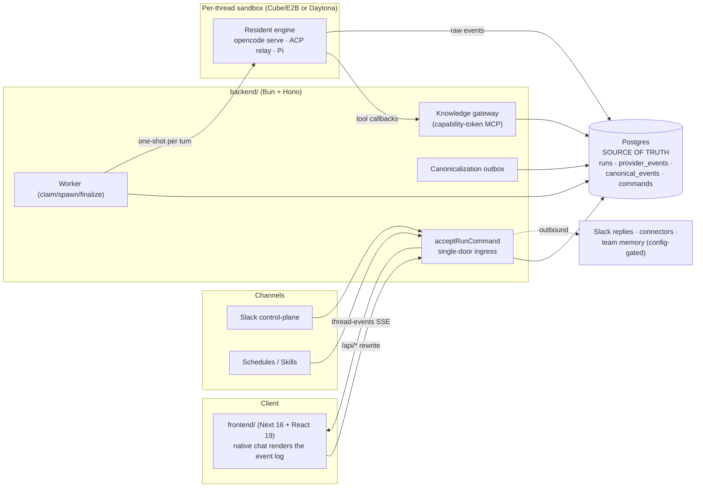
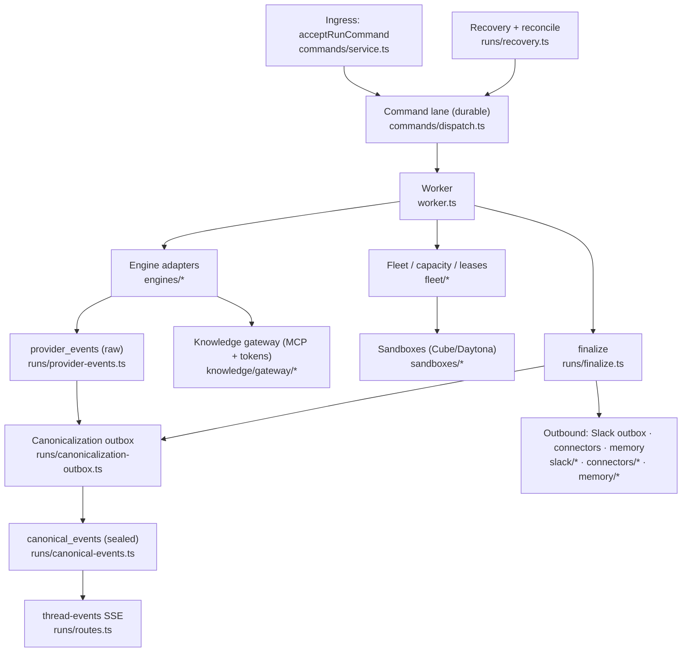
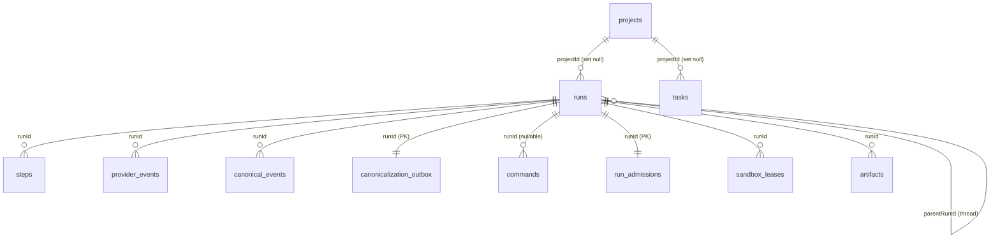

# useAgent - Architecture (verified map)

Single source-of-truth map of the useAgent (internal codename "skynet") platform, so
structure does not have to be re-investigated. Every non-trivial claim carries
`path:line` evidence checked against **origin/main** (`c07d2f05`). Where something could
not be confirmed it is marked **UNVERIFIED** rather than guessed.

**Companions:**
- [`architecture-graph.md`](./architecture-graph.md) - the **map you look at** (all mermaid diagrams:
  system context, subsystem dependency graph, run lifecycle, data model, capability matrix). This doc
  (`ARCHITECTURE.md`) is the **map you read**.
- [`codebase-map.html`](../../codebase-map.html) - interactive isometric "city map" (repo root),
  generated by the `codebase-map` skill. **Not committed in-repo at this commit** (see §8).
- `docs/architecture/request-flow.html` - an existing in-repo visual of the request flow.

> **Maintenance rule (rewrite-on-change, like `quality.md`):** when the code moves, REWRITE the
> affected section to state the plain current truth - do not patch-annotate or stack "update:"
> notes. Keep it a map, not a changelog. Re-verify `path:line` on every edit (line numbers drift).
> Keep the two docs in sync: a structural change updates BOTH this doc and `architecture-graph.md`.

---

## 1. System overview

useAgent is an event-sourced platform for running coding/agent turns in isolated cloud
sandboxes. **Postgres is the source of truth**: every run is a durable command; the engine's
raw output is captured as `provider_events`, sealed and translated into provider-neutral
`canonical_events`, and fanned out to the browser over one thread-scoped SSE stream. The
harness lives **outside** the sandbox - the backend is a thin client over an agent process
(OpenCode / Claude ACP / Codex ACP / Pi) that runs *resident inside* a per-thread sandbox.
The UI renders the event log; it never renders a live process. Runs enter through a **single
door** (`acceptRunCommand`) shared by web, Slack, schedules, skills and child sessions.



Two standalone apps, no workspace/turbo: `frontend/` (Next 16 + React 19, `/api/*` rewritten
to the backend on `:3201`) and `backend/` (Bun + Hono + Postgres/Drizzle). Extracted logic
lives in `packages/` (`@useagent/*`, linked via `file:` deps, not npm workspaces).

---

## 2. Subsystem map



### 2.1 Ingress + command lane (single door)
`acceptRunCommand(input)` is the sole run-creation seam. It commits the command + run row
atomically, idempotent by `(orgId, idempotencyKey)`, classifying a resubmission as
`created` / `replayed` / `conflict`, then fires one post-commit thread signal so every
connected stream wakes without polling.
- `acceptRunCommand` -> `acceptRunCommandWithOrigin` - `backend/src/commands/service.ts:194`, `:91`
- Replay classification `classifyReplay` - `backend/src/commands/service.ts:28`; unique-race re-read `:169`
- Post-commit `publishRunLifecycleChange(... kind:"created")` - `backend/src/commands/service.ts:183`
- All five ingress callers: Slack `backend/src/slack/events.ts:509`, schedules `backend/src/schedules/fire.ts:116`, web `backend/src/runs/routes.ts:524`, skills `backend/src/skills/routes.ts:348`, child sessions `backend/src/runs/child-sessions.ts:194`

### 2.2 Worker + turn claiming
A conversation is **sequential**: at most one live engine turn per thread. Claiming is durable
on the `commands` table (not an in-memory chain): under a per-thread advisory lock, the oldest
`queued` command is CAS-flipped to `dispatched`.
- `claimNextRun` (per-thread `pg_advisory_xact_lock(hashtext(threadId))`, CAS to dispatched) - `backend/src/commands/dispatch.ts:51`, lock `:54`, CAS `:62`
- `spawnWorker` (no-ops if already in registry) - `backend/src/worker.ts:219`; sequential-turn note `:233`
- `beginEngineRun` (status -> running, insert step 0) - `backend/src/worker.ts:261`
- Per-run dispatch happens exactly once: `runProviderTurn(engineId, ctx)` then `finalizeRun(...)` - `backend/src/worker.ts:933`, `:943`
- Thread pump / settle: `pumpThread` -> `pumpThreadWithGate` `backend/src/worker.ts:242`; `onRunSettled` frees + pumps next `:247`

### 2.3 Engine adapters
See §5 for the capability matrix. Adapters implement `EngineAdapter.run(ctx)`; the typed
control seam (`HarnessAdapter`) is re-exported from `@useagent/agent-harness`. Registered
providers resolve through a `providerRegistry`.
- `EngineAdapter` (`id` + `run(ctx)`) - `backend/src/engines/types.ts:167`
- `EngineRunContext` (the per-run input struct + emit/delta callbacks + `AbortSignal`) - `backend/src/engines/types.ts:45`
- `providerRegistry` (acp, claude, claude-sdk, codex, daytona, opencode, pi) - `backend/src/engines/index.ts:158`
- `HarnessAdapter` real definition - `packages/agent-harness/src/control.ts:105`

### 2.4 Event sourcing (raw -> sealed)
- `provider_events` (raw engine output, per-run monotonic `seq`, idempotent upsert by native id, live native-frame push) - `recordProviderEvent` `backend/src/runs/provider-events.ts:119`; `persistAndPublish` `:147`
- Drain barrier (await the run's in-flight serial capture chain; process-local) - `drainProviderEvents` `backend/src/runs/provider-events.ts:75`
- Canonicalize: drain -> watermark -> translate -> re-read -> **atomic** replace, publish only after commit - `canonicalizeRun` `backend/src/runs/canonicalization-outbox.ts:160`; drain `:163`
- Watermark = max frame seq + step count + md5 step-content signature - `sourceWatermark` `backend/src/runs/canonicalization-outbox.ts:101`; `watermarkStable` `:75`
- Atomic finalize of canonical rows + `complete` outbox flip in one txn - `finalizeCanonicalForRun` `:132`; `replaceCanonicalRowsTx` `backend/src/runs/canonical-events.ts:152`
- `canonical_events` are written only for a COMPLETE run (never provisionally).

### 2.5 SSE fan-out (thread-scoped)
One EventSource per page (keyed by root thread id): authorizes the root run server-side,
replays the canonical thread from offset 0, then streams live via process-local EventEmitters.
- Route `GET /:rootRunId/thread-events` - `backend/src/runs/routes.ts:979`
- Process-local buses (non-durable, repaired by reconnect + full replay): run `bus` `backend/src/worker.ts:66`, `threadBus` `backend/src/runs/thread-signals.ts:30`, canonical `bus` `backend/src/runs/canonical-events.ts:31`, `nativeBus` `backend/src/runs/native-events.ts:28`, `orgBus` `backend/src/runs/org-signals.ts:41`
- Frontend consumer: `useThreadStream` (URL `/api/runs/${rootRunId}/thread-events`, coalesced per animation frame) - `frontend/components/chat/use-thread-stream.ts:228`; reducer `createThreadStore` `frontend/components/chat/thread-store.ts:82` (snapshot MERGES, never resets `:260`)

### 2.6 Finalize
The single terminal seam. `completeRun` is first-finalizer-wins; in the SAME txn it enqueues
memory capture, Slack reply, automation delivery, canonicalization and learning; post-commit it
signals `settled`.
- `finalizeRun` - `backend/src/runs/finalize.ts:149`; guard `completeRun` `:168`; `enqueueCanonicalization` `:233`; post-commit `settled` `:270`

### 2.7 Knowledge gateway + capability tokens
A separate, sandbox-reachable HTTP server the untrusted engine calls back into for tools. It
holds no session auth; identity is carried in a stateless HMAC capability token whose org is
**derived server-side** and re-validated against the live `runs` row on every call.
- Gateway app mounts (`/api/mcp/knowledge`, `/api/provider`) - `backend/src/gateway-app.ts:12`; process/port `backend/src/gateway.ts:11` (default `GATEWAY_PORT` 3202)
- `ToolTokenClaims` (`orgId,userId,threadId,runId,scope,exp`) - `backend/src/knowledge/gateway/token.ts:37`; stateless HMAC format `:16`; mint `:79`; verify (fail-closed) `:106`
- Org derived from trusted run context, never a tool arg: `orgId: ctx.orgId` at mint - opencode `backend/src/engines/opencode-server.ts:509`, ACP `backend/src/engines/acp-server.ts:401`
- Per-call re-derivation from live `runs` row (403 on mismatch) - `resolveAuthorizedToolRun` `backend/src/knowledge/gateway/run-authorization.ts:40`
- Tool families registry (~22 descriptor sets: knowledge, context, memory, integrations, github, skills, tasks, slack, child-session, etc.) - `backend/src/knowledge/gateway/operation-registry.ts:114`
- `db/gateway-grants.ts` is the least-privilege SQL grant manifest for the restricted `skynet_gateway` role (NOT a relay-grant table) - `backend/src/db/gateway-grants.ts:21`

### 2.8 Sandboxes + fleet + capacity
Provider-neutral sandbox contract; **Cube (E2B protocol)** is the production substrate,
**Daytona** the legacy alternative, selected by `SANDBOX_PROVIDER` (default `"daytona"` in code).
A durable capacity layer (`run_admissions` + `sandbox_leases`) gates spawns; an HA reconciler
keeps leases honest across crashes.
- Contract `SandboxProvider` (`create/get/list/inventory`), `SandboxProviderKind = "daytona"|"cube"` - `packages/sandbox-contract/src/index.ts:174`, `:14`
- Selector: `sandboxProviderKind()` default `"daytona"` - `backend/src/sandboxes/provider.ts:24` (`|| "daytona"` `:27`); dispatch `:73`
- Cube adapter `class CubeProvider implements SandboxProvider` - `backend/src/sandboxes/cube-provider.ts:364`; Daytona adapter `backend/src/sandboxes/daytona-provider.ts:1`
- Warm pool (config-gated, off by default): active Cube pool `CubeWarmPool` `backend/src/sandboxes/cube-warm-pool.ts:74`; legacy Daytona `ensureWarmPool` `backend/src/sandboxes/warm-pool.ts:136`
- Capacity admission (advisory-locked, mints a lease) - `admitClaimedRun` `backend/src/fleet/admission.ts:43`, `pg_advisory_xact_lock('fleet-admission')` `:47`
- Tables: `run_admissions` `backend/src/db/schema/fleet.ts:59`; `sandbox_leases` (one active lease per run) `:107`, `:153`
- HA reconciler (5s: heartbeat, claim-expired, GC crashed, pump admittable) - `reconcileFleetOnce` `backend/src/fleet/reconciler.ts:109`; boot `backend/src/index.ts:415`
- Fleet view `GET /api/fleet` (model burn from `provider_events` `part.step-finish` + live sandbox footprint) - `backend/src/runs/fleet-routes.ts:15`; `getModelBurn` `backend/src/runs/fleet.ts:47`; `getMachineStats` `:163`
- Deployment-drain admission (a DIFFERENT, deploy/drain barrier on `commands`) - `backend/src/commands/admission.ts:43`

### 2.9 Recovery + reconcile (two distinct subsystems)
- **Run-recovery** boot pass: resolve dispatched commands, park still-running native sessions, fail orphans - `recoverStaleRuns` `backend/src/runs/recovery.ts:98`; boot call `backend/src/index.ts:137`; park queue `reconcile_queue` `backend/src/db/schema/reconcile.ts:15`, ops `backend/src/runs/reconcile-queue.ts:56`
- **Fleet lease reconciler** (separate, §2.8) - `backend/src/fleet/reconciler.ts:109`

### 2.10 Bearer auth lane ("uak" user API keys)
Fail-closed, deny-by-default bearer lane for non-interactive local-to-cloud fleet dispatch;
only the SHA-256 hash is stored, plaintext shown once.
- Table `api_keys` (hash + prefix + soft-delete) - `backend/src/db/schema/api-keys.ts:21`
- Mint/verify (`uak_` prefix, inner-join `member` to fail closed on lost membership) - `backend/src/api-keys/store.ts:14`, `:122`
- Middleware (deny-by-default allowlist: `GET /api/config`, `POST /api/runs`, read-only GETs) - `backend/src/middleware/bearer.ts:79`; registered `backend/src/index.ts:206`

### 2.11 Outbound + peripheral subsystems
- **Slack control-plane** (env-gated Events-API + Socket-Mode ingress -> `acceptRunCommand`; durable **outbox** for every outbound call, enqueued inside the finalize txn) - inbound `backend/src/slack/events.ts:509`; outbox `backend/src/slack/outbox/index.ts:20`; delivery worker `backend/src/slack/outbox/delivery.ts:8`
- **Connectors** (channel-neutral Transport + Renderer, ported from reference bot; run streams onto any surface) - `backend/src/connectors/types.ts:88`, `:159`; `attachRunFeed` `backend/src/connectors/runFeed.ts:43`
- **Integrations / OpenConnector** (delegated OAuth/action backend for non-github/slack providers; env-gated, fails safe) - `backend/src/integrations/open-connector.ts:55`, `:114`; wired `backend/src/integrations/service.ts:86`
- **Memory** (team memory, **config-gated**: `MEMORY_API_URL` unset = fast no-op; a memory failure never fails a run) - `memoryConfig()` `backend/src/env.ts:150`; swallow-all + 4s timeout `backend/src/memory/team-memory.ts:5`, `:376`
- **Secrets** (AES-256-GCM, key via HKDF-SHA256; write-only API; injected as a `0600` dotenv into the sandbox) - `createCipheriv("aes-256-gcm", ...)` `backend/src/secrets/crypto.ts:132`; `hkdfSync` info `"skynet-org-secrets-v1"` `:120`; inject `backend/src/secrets/inject.ts:15`
- **Schedules** (cron + manual firing -> fresh thread root via `acceptRunCommand`, per-occurrence idempotency) - `fireScheduleWithOutcome` `backend/src/schedules/fire.ts:69`
- **Skills** (import a repo's `SKILL.md` into versioned org skills; deterministic, source-keyed idempotency) - `backend/src/skills/import.ts:14`
- **Artifacts** (content-addressed by sha256; served to browser + Slack; Office->PDF preview) - `LocalArtifactStorage` `backend/src/artifacts/storage.ts:28`; descriptor `backend/src/artifacts/repo.ts:17`
- **Wiki-gen** (deepwiki-style two-phase repo wiki -> org knowledge docs) `backend/src/wiki-gen/generate.ts:1`; **Learning** (human-governance review of knowledge drafts + skill proposals) `backend/src/learning/routes.ts:24`
- **Provider-connections** (Codex/ChatGPT BYO-subscription auth) + **provider-gateway** (LLM credential resolution: user_connection > org_secret > backend_env) - distinct from the connector/integration story

---

## 3. Run lifecycle (sequence)

```mermaid
sequenceDiagram
  participant Ch as Channel (web/Slack/schedule)
  participant Acc as acceptRunCommand
  participant DB as Postgres (commands/runs)
  participant Wk as Worker
  participant Adm as Fleet admission
  participant Eng as Engine adapter (in sandbox)
  participant PE as provider_events
  participant Cx as Canonicalization outbox
  participant CE as canonical_events
  participant SSE as thread-events SSE

  Ch->>Acc: acceptRunCommand(input)
  Acc->>DB: commit command+run (idempotent by org,key)
  Acc-->>SSE: publishRunLifecycleChange("created")
  Wk->>DB: claimNextRun (advisory lock, CAS queued->dispatched)
  Wk->>Adm: admitClaimedRun (mint sandbox_lease)
  Wk->>DB: beginEngineRun (status=running, step 0)
  Wk->>Eng: runProviderTurn(engineId, ctx)  [one-shot per turn]
  loop streaming
    Eng->>PE: recordProviderEvent (raw, monotonic seq)
    PE-->>SSE: live native frame (persist-before-publish)
  end
  Eng-->>Wk: turn returns
  Wk->>DB: finalizeRun (terminal status; enqueue canonicalization + side-effects, 1 txn)
  Wk-->>SSE: publishRunLifecycleChange("settled")
  Wk->>DB: onRunSettled -> settleCommand + pumpThread(next)
  Cx->>PE: drainProviderEvents (seal) + sourceWatermark
  Cx->>CE: canonicalizeRun -> atomic replace (only if watermark stable)
  Cx-->>SSE: publish canonical rows + canonicalization-complete
  SSE-->>Ch: replay canonical thread + live tail
```

Grounding: accept `commands/service.ts:194`; claim `commands/dispatch.ts:51`; admit
`fleet/admission.ts:43`; begin `worker.ts:261`; dispatch `worker.ts:933`; capture
`runs/provider-events.ts:119`; finalize `runs/finalize.ts:149`; settle+pump `worker.ts:247`;
canonicalize `runs/canonicalization-outbox.ts:160`; SSE `runs/routes.ts:979`.

---

## 4. Data model

**44 tables** total (`grep -rn "pgTable(" backend/src/db`), split across
`backend/src/db/schema/*.ts` (21 domain files, re-exported by `backend/src/db/schema.ts:4`)
plus `backend/src/db/auth-schema.ts` (7 better-auth tables). `runs` is the hub.

### 4.1 Inventory (by domain)
| Domain | Tables (`table` = const) - `file:line` |
|---|---|
| Runs / Events / Steps | `runs` `schema/runs.ts:39`; `steps` `:146`; `provider_events` `schema/provider-events.ts:11`; `provider_gateway_audit` `:43` |
| Canonical | `canonical_events` `schema/canonical.ts:29`; `canonicalization_outbox` `:67` |
| Commands | `commands` `schema/commands.ts:16`; `commands_catalog` `schema/commands-catalog.ts:23` |
| Approvals | `gateway_approval_requests` `schema/approvals.ts:22` |
| Reconcile | `reconcile_queue` `schema/reconcile.ts:15` |
| Fleet / capacity | `run_admissions` `schema/fleet.ts:59`; `sandbox_leases` `:107` |
| Projects / Tasks | `projects` `schema/projects.ts:15`; `tasks` `schema/tasks.ts:24` |
| Schedules | `schedules` `schema/schedules.ts:27`; `schedule_firings` `:87` |
| Skills / Learning | `skills` `schema/skills.ts:30`; `skill_revisions` `:74`; `knowledge_drafts` `schema/learning.ts:96`; `skill_revision_proposals` `:129`; `learning_outbox` `:174` |
| Integrations | `integration_connections` `schema/integrations.ts:40`; `integration_connection_credentials` `:107`; `integration_connect_sessions` `:134` |
| Provider-connections | `provider_connections` `schema/provider-connections.ts:42`; `provider_connection_threads` `:77` |
| Slack | `slack_workspaces` `schema/slack.ts:15`; `slack_users` `:27`; `slack_threads` `:43`; `slack_run_responses` `:65`; `slack_outbox` `:120` |
| Uploads / Artifacts | `artifacts` `schema/artifacts.ts:25`; `artifact_workpiece_proposals` `:67`; `user_uploads` `schema/uploads.ts:11` |
| Secrets / API keys | `secrets` `schema/secrets.ts:21`; `api_keys` `schema/api-keys.ts:21` |
| Memory | `memory_outbox` `schema/memory.ts:18` |
| Auth / Org (better-auth) | `user` `auth-schema.ts:11`; `session` `:24`; `account` `:44`; `verification` `:68`; `organization` `:84`; `member` `:97`; `invitation` `:116` |

### 4.2 Core relations

FK evidence: `steps.runId` `schema/runs.ts:150`; `provider_events.runId`
`schema/provider-events.ts:15`; `canonical_events.runId` `schema/canonical.ts:35`;
`canonicalization_outbox.runId` (PK) `:70`; `commands.runId` `schema/commands.ts:28`;
`run_admissions.runId` `schema/fleet.ts:63`; `sandbox_leases.runId` `:111`;
`runs.parentRunId` self-ref `schema/runs.ts:58`; `runs.projectId` `:46`;
`tasks.projectId` `schema/tasks.ts:29`; `artifacts.runId` `schema/artifacts.ts:31`.
Outbox tables (`reconcile_queue`, `memory_outbox`, `learning_outbox`) deliberately carry
`run_id`/`thread_id` as plain columns without `.references()`.

### 4.3 Project identity - CORRECTED finding
> The prior "no first-class projects table; project is DERIVED from run repo strings" note is
> **outdated at this commit.** `projects` is now a first-class, populated table (migration
> `0063_projects`, `backend/drizzle/meta/_journal.json`).

- `projects` is real and populated: `ensureProject(orgId, primaryRepo, ...)` is called on run
  acceptance (`backend/src/runs/repo.ts:199`, then `projectId: project?.id ?? null` `:216`) and on
  task creation (`backend/src/tasks/repo.ts:56`).
- `runs.projectId` and `tasks.projectId` are **real FKs** to `projects.id` (both `onDelete:"set null"`)
  - `backend/src/db/schema/runs.ts:46`, `backend/src/db/schema/tasks.ts:29`.
- What REMAINS true from the old finding: `tasks.projectKey` is a **free string with NO `.references()`**
  (`backend/src/db/schema/tasks.ts:33`) - now a denormalized mirror of the resolved project key; and
  `runs.repo`/`runs.repos` stay string "compatibility metadata, not identity" (`schema/runs.ts:44`,
  `schema/projects.ts:12`).

**Net:** project is BOTH a first-class durable entity (FK identity) AND redundantly represented
by legacy string columns (the derived/compat mirror). The FK is identity; the strings are compat.

---

## 5. Engine capability matrix

Capabilities are a **computed function**, not a static table: `sessionCapabilities(engine, res)`
returns the one `NegotiatedCapabilities` map the UI reads (React never checks a provider name).
A capability is `true` only when actually wired/provisioned. Source: `backend/src/engines/capabilities.ts:25`
(map literal `:31-66`); tests confirm every value in `backend/src/engines/capabilities.test.ts`.

Values below are for a cold session (`res={desktop:false, knowledgeTools:false}`). The last column
is any engine running under the T3 canonical-orchestration runtime (`res.runtimeOrchestration:true`).

| Capability (`capabilities.ts` line) | opencode | claude | codex | pi | + T3 runtime |
|---|:--:|:--:|:--:|:--:|:--:|
| `streamingText` (`:36`) | Y | Y | Y | Y | Y |
| `toolProgress` (`:37`) | Y | Y | Y | Y | Y |
| `fileDiffs` (`:38`) | Y | N | N | N | Y |
| `commands` (`:39`) | Y | Y | Y | Y | Y |
| `directTerminal` (`:40`) | Y | Y | Y | Y | Y |
| `nativeChildProjection` (`:43`) | Y | N | N | Y | Y |
| `gatewayChildSessions` (`:45`) | =knowledgeTools | =knowledgeTools | =knowledgeTools | =knowledgeTools | Y iff knowledgeTools |
| `reasoning` (`:47`) | Y | N | N | Y | Y |
| `resume` (`:48`) | Y | Y | Y | Y | Y |
| `load` (`:49`) | Y | Y | Y | Y | Y |
| `stop` (`:50`) | Y | Y | Y | Y | Y |
| `plans` (`:52`) | Y | N | N | Y | Y |
| `usage` (`:53`) | Y | N | N | Y | Y |
| `modelSelection` (`:54`) | Y | N | Y | Y | (claude stays N) |
| `reconcile` (`:58`) | Y | N | N | N | Y |
| `close` (`:59`) | N | Y | Y | Y | N |
| `nativeEmbed` (`:60`) | Y | N | N | N | N |
| `approvals` (`:61`) | N | N | N | N | Y |
| `questions` (`:62`) | Y | N | N | N | Y |
| `desktop` (`:64`) | =res.desktop | =res.desktop | =res.desktop | =res.desktop | =res.desktop |
| `knowledgeTools` (`:65`) | =res.knowledgeTools | =res.knowledgeTools | =res.knowledgeTools | =res.knowledgeTools | =res.knowledgeTools |

Registered engine ids: `acp`, `claude`, `claude-sdk` (alias->claude), `codex`, `daytona`
(alias->opencode), `opencode`, `pi` - `backend/src/engines/index.ts:158`. Alias normalization
`canonicalEngine` (`daytona`->`opencode`, `claude-sdk`->`claude`) `backend/src/engines/engine-alias.ts:8`.
`gatewayChildSessions` are engine-independent (they use the product command lane), so ACP
claude/codex get them when `knowledgeTools` is loaded.

---

## 6. Hard constraints / invariants

1. **Single-backend deployment** (one backend per database). Boot acquires a session-level
   Postgres advisory lock held for the process lifetime; a duplicate WARNs by default and REFUSES
   to boot when `REQUIRE_SINGLE_BACKEND=1`. Rationale: the canonicalization drain/seal barrier
   (`drainProviderEvents`) and the SSE fan-out (thread-signals + canonical-events EventEmitters)
   are **process-local**. `FOR UPDATE SKIP LOCKED` protects only which worker **claims** a
   canonicalization - not sealing or fan-out. Multi-replica realtime needs a durable DB-backed
   seal first.
   - `enforceSingleBackend` / `pg_try_advisory_lock(0x536b4e74)` - `backend/src/db/single-backend.ts:52`, key `:7`, lock `:61`, refuse `:85`; rationale `:35-41`; `FOR UPDATE SKIP LOCKED` note `:37`
   - Boot call before migrate/recovery - `backend/src/index.ts:99`
   - Shared claim primitive (CTE + `for update skip locked`) - `backend/src/db/outbox.ts:93`
2. **One live turn per thread.** Turn claiming CAS-flips the oldest queued command under a
   per-thread advisory lock; child sessions are DEFERRED serial thread turns (one run per thread),
   never parallel.
   - `claimNextRun` - `backend/src/commands/dispatch.ts:51`; sequential note `backend/src/worker.ts:233`
   - Child = deferred serial turn (enqueues a new command on the same thread) - `backend/src/runs/child-sessions.ts:97`; descriptor text `backend/src/knowledge/gateway/child-session-tools.ts:22`
3. **Harness outside the sandbox.** The backend is a thin client; the agent loop runs resident
   inside the per-thread sandbox (opencode `opencode serve`, claude/codex via an in-sandbox ACP
   relay). Dispatch is one-shot per turn.
   - `types.ts:176` ("does NOT mean the agent loop moved out of the sandbox"); `backend/src/engines/index.ts:36`; one-shot dispatch `backend/src/worker.ts:933`
4. **Migration when-trap.** The boot migrator applies only journal entries whose `when` is greater
   than the last applied; migrations are hand-stamped into the future, so a new migration must be
   stamped strictly above the journal tail (has silently skipped migrations twice).
   - `migrate(db, ...)` - `backend/src/index.ts:105`; journal tail (hand-set future `when`, `0063_projects`) - `backend/drizzle/meta/_journal.json`
5. **Persist-before-publish.** Both the raw native lane and the canonical lane publish only after
   the DB write commits, so subscribers never see uncommitted state.
   - raw `backend/src/runs/provider-events.ts:147`; canonical `backend/src/runs/canonicalization-outbox.ts:194`
6. **Fail-closed capability tokens.** Gateway tool identity comes only from a signed token whose
   org is minted from the trusted run context and re-validated against the live `runs` row; a
   tenant id in a tool argument cannot be honored.
   - `backend/src/knowledge/gateway/token.ts:106`; `backend/src/knowledge/gateway/run-authorization.ts:40`

---

## 7. Licensing boundary

> The premise of an "AGPL core / Apache packages" split is **NOT evidenced in-repo at this commit.**
> There is no license split, no AGPL text, no per-package license, and no SPDX headers.

Verified in-repo facts:
- No `LICENSE`/`COPYING` file anywhere (`find -iname "license*"` empty); no `LICENSES/` dir; no
  `SPDX-License-Identifier` under `packages/`.
- No `"license"` field in the root, `backend/`, `frontend/`, or any of the 7 `packages/*/package.json`.
  The root is `"private": true` (`package.json:2-3`); packages are `@useagent/*`, `"private": true`,
  `"version":"0.0.0"`.
- The only license statement is `NOTICE` (attribution, not a grant): reference bot = **Apache-2.0**
  (bundled port under `backend/src/connectors/`, `engines/acp.ts`, `schedules/`); AlignUI /
  prompt-kit / T3 session-UI = **MIT** vendored (`NOTICE:1-16`).
- Vendored UI keeps its MIT source header (e.g. T3 Code header `frontend/components/session-ui/work-entry-row.tsx:3`).
- `packages/MODULAR-AUDIT.md:77` states "External-package readiness: NOT claimed" - the packages
  are extracted behind facades but internal/private, so no per-package license has been assigned.

Fuller reference: `~/Desktop/quality.md` (on the user's Desktop, **outside** the repo; not read
here). If an AGPL/Apache boundary is intended, it is aspirational and not yet reflected in-repo.

---

## 8. Known gaps / UNVERIFIED

- **`thread-events` inner subscription line numbers.** The route opens at `backend/src/runs/routes.ts:979`;
  the exact absolute lines of `subscribeThread`/`subscribeCanonicalThread`/`subscribeCanonicalizationComplete`/`loadCanonicalThread`
  (~`:1152/:1156/:1160/:1211`) were located by offset grep, not each confirmed individually. The wiring itself is verified present.
- **`claude` `modelSelection:false` under the T3 runtime lane.** `sessionCapabilities` has no runtime
  branch for `modelSelection` (`capabilities.ts:54`), yet the T3 driver descriptor sets
  `model.selection:"per_turn"` (`backend/src/engines/t3-provider-driver.ts:166`). Whether the divergence
  is intentional is UNVERIFIED.
- **`acpAutoApprove()` default / env var.** "Yolo" auto-approval is dev/env-gated and the ACP/CLI
  permission path is fail-closed by default (`backend/src/engines/permission-policy.ts:33`), but the exact
  env var and default for `acpAutoApprove()` (in `backend/src/env.ts`) was not read.
- **OpenConnector OAuth bootstrap** lives in `deploy/hetzner/*` shell scripts (out of backend-source
  scope); confirmed to exist, not read in depth. The runtime only CONSUMES `/api/oauth/configs`.
- **`provider-gateway` internal auth path** (BYOK proxy, `/api/provider`) was not investigated in depth.
- **Frontend design-system file counts** (`components/base` 58, `components/ui` 43) include colocated
  `*.test.*` files; non-test tallies were not separated. The migration direction (base = target BoardUI
  kit; ui = legacy AlignUI, do-not-extend, overlays only) is verified from `frontend/AGENTS.md:4`, `:67`.
- **Naming cutover in progress:** DB/label strings still carry `skynet-*` (e.g. `skynet-run`,
  `skynet-warm-pool-template`) while newer code uses `useAgent`/`uak_`/`USEAGENT_*`.
- **`codebase-map.html` is not committed in-repo** at this commit (not tracked in git, absent from the
  repo root in both the main checkout and the origin/main worktree). The companion link assumes it is
  generated at the repo root by the `codebase-map` skill; regenerate it there to make the link resolve.

---

*Verified against origin/main `c07d2f05` by an 8-way parallel code sweep with independent spot-checks.
All `path:line` references are relative to the repo root. Rewrite-on-change; re-verify lines on edit.*
