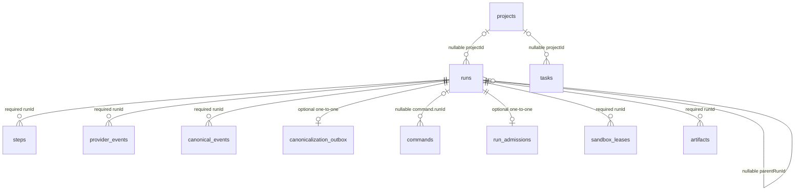

# useAgent architecture map

Repository map verified against the `origin/main` base commit **`35ab7cd3`**. All paths are
repository-root-relative. This document describes the checked-in code, not a deployment claim.

Companions:

- [`docs/architecture/architecture-graph.md`](./architecture-graph.md) contains the diagrams.
- [`docs/architecture/request-flow.html`](./request-flow.html) is the existing request-flow visual.

When code moves, rewrite the affected section and re-check every cited line. Keep this document
and `docs/architecture/architecture-graph.md` consistent.

## 1. Runtime shape

The product has two user-facing execution lanes over one durable run/thread model:

| Lane | Execution | Durable and live delivery |
|---|---|---|
| Agent engines (`opencode`, `claude`, `codex`, `pi`) | A resident engine runs inside a per-thread Cube or Daytona sandbox; the backend dispatches one provider turn. | Runs, steps, raw provider events, and sealed canonical events are stored in Postgres. The browser also receives process-local live frames. |
| Direct Chat (`chat`) | The worker retrieves read-only knowledge/memory context and streams an OpenRouter completion directly. It does **not** create or use a sandbox. | It uses the same run, command, step, transient-delta, finalization, and thread-SSE paths as agent turns. |

The Chat split is explicit in the worker: `chat` branches before agent context and adapter setup
(`backend/src/worker.ts:L357-L366`), and its direct provider call lives in
`backend/src/worker.ts:L623-L745` and `backend/src/chat/stream.ts:L44-L109`. The session UI hides
terminal/desktop runtime surfaces for Chat (`frontend/components/chat/session-view.tsx:L569-L581`).
Chat remains in the server's user-facing engine/readiness catalog
(`backend/src/runs/engine-readiness.ts:L12-L13`, `backend/src/runs/engine-readiness.ts:L121-L125`),
but the current new-thread engine picker excludes it from explicit choices
(`frontend/app/agent/new/new-task-composer.tsx:L298-L313`).

The frontend is Next.js/React, the backend is Bun/Hono/Postgres/Drizzle, and shared code is in
seven private `@useagent/*` packages linked with `file:` dependencies rather than a workspace.

## 2. Ingress and transport scope

### 2.1 Durable run acceptance

New work converges on `acceptRunCommand`. It validates a new engine/model decision, commits the
run and `run.create` command atomically, deduplicates keyed retries by organization and payload
fingerprint, and publishes a post-commit lifecycle signal
(`backend/src/commands/service.ts:L81-L190`). Current product callers are:

- web/API: `backend/src/runs/routes.ts:L524`
- Slack: `backend/src/slack/events.ts:L509`
- schedules: `backend/src/schedules/fire.ts:L116`
- skills: `backend/src/skills/routes.ts:L348`
- child sessions: `backend/src/runs/child-sessions.ts:L194`

This is a **run-creation** convergence point, not the only control path. Cancellation is a separate
durable `run.cancel` command (`backend/src/commands/cancel.ts:L11-L27`), and question/approval
responses are control traffic for an already-running native session
(`backend/src/runs/routes.ts:L614-L625`).

### 2.2 CLI and local MCP

`packages/cli` adds no backend execution protocol. Human commands `run`, `fan`, and `status` call
the fleet client (`packages/cli/src/bin.ts:L20-L29`); that client uses the existing HTTP run and
thread APIs (`packages/agent-client/src/fleet.ts:L1-L7`, `packages/agent-client/src/fleet.ts:L210-L218`).
`--watch` and batch settlement poll durable thread state; they do not consume the browser SSE
(`packages/cli/src/commands.ts:L24-L46`, `packages/agent-client/src/fleet.ts:L62-L73`).

`useagent mcp` is a **local stdio MCP transport** that exposes four fleet tools to a local agent
(`packages/cli/src/mcp.ts:L1-L6`, `packages/cli/src/mcp.ts:L211-L215`). Tool handlers then call the
same authenticated fleet client; the backend does not expose a second MCP-specific run lane.

## 3. Command, capacity, and worker execution

Each thread is sequential. Under a per-thread advisory lock, `claimNextRun` refuses to claim when
a `run.create` command is already dispatched, otherwise CAS-updates the oldest queued command
(`backend/src/commands/dispatch.ts:L45-L74`). The fleet pump then consults durable admission and
only spawns after admission succeeds (`backend/src/fleet/pump.ts:L16-L35`).

Acceptance writes a `run_admissions` row in the same transaction as the run and command
(`backend/src/commands/repo.ts:L104-L129`). Admission decisions are serialized by a database
advisory lock; an absent admission row is a documented legacy/direct-create compatibility bypass
that admits without a lease (`backend/src/fleet/admission.ts:L36-L57`).

For agent engines, the worker marks the run running, creates the initial durable step, constructs
the engine context, and calls `runProviderTurn` once
(`backend/src/worker.ts:L257-L277`, `backend/src/worker.ts:L927-L944`). Provider registration and
the production driver/adapter dispatch are in `backend/src/engines/index.ts:L156-L166` and
`backend/src/engines/index.ts:L192-L216`.

## 4. Event and UI delivery lanes

Postgres is the durable replay source, but the UI also has a deliberately transient live lane.
These paths must not be collapsed into one claim:

| Lane | Authority and lifetime | Browser path |
|---|---|---|
| `runs` + `steps` | Durable lifecycle and compatibility projection. | Thread snapshot/run/step frames. |
| `provider_events` | Durable bounded native capture with per-run sequence. | Replayed native frames and live native frames. |
| `canonical_events` | Durable provider-neutral projection. A run is trusted as canonical only after its canonicalization outbox completes. | Canonical and canonical-complete frames. |
| `turnStream` | Process-local live answer/reasoning deltas. Answer text is capped and retained briefly; reasoning is live-only. Neither is reconnect truth. | `delta` frames, then cleared when the run settles. |

The transient contract is defined in `backend/src/runs/turn-stream.ts:L1-L20`; buffering and
eviction are implemented in `backend/src/runs/turn-stream.ts:L54-L140`. The worker publishes into
it (`backend/src/worker.ts:L911-L929`), and the thread SSE subscribes per run
(`backend/src/runs/routes.ts:L1048-L1070`). The frontend batches frames per animation frame
(`frontend/components/chat/use-thread-stream.ts:L200-L247`) and clears transient answer/reasoning
on durable settlement (`frontend/components/chat/thread-store.ts:L327-L331`).

The thread SSE route is authorized from the root run, derives the thread server-side, and
multiplexes snapshot, run, step, delta, native, canonical, canonical-complete, and done frames
(`backend/src/runs/routes.ts:L954-L1000`). Its in-memory queue is bounded; overflow closes the
connection so the client can reconnect to a fresh durable snapshot
(`backend/src/runs/routes.ts:L1035-L1046`).

Raw provider events persist before native publication
(`backend/src/runs/provider-events.ts:L119-L156`). Canonicalization drains in-flight capture,
computes a source watermark, replaces the run's canonical rows transactionally, and publishes
after commit (`backend/src/runs/canonicalization-outbox.ts:L160-L202`).

## 5. Terminal-path matrix

There is no single terminal seam. `finalizeRun` is the normal side-effectful path, while several
pre-execution or legacy paths deliberately update terminal state without it.

| Trigger | Terminal writer | Side effects and follow-up |
|---|---|---|
| Normal mock, Chat, or provider success/failure; worker setup failure | `finalizeRun` | First finalizer wins via `completeRun`; releases a lease; conditionally enqueues memory, Slack/automation delivery, canonicalization, and learning; publishes `settled`. The worker finally settles the command, releases/synchronizes admission, and pumps the thread. |
| Boot/adaptive recovery, expired-lease failure, running cancel with no live actor | `finalizeRun` | Same finalization transaction; each caller separately settles/pumps or synchronizes its recovery state. |
| Queued cancellation | direct `completeRun` inside `acceptRunCancel` | In the same transaction: fails the never-started run, completes its `run.create`, releases its lease, and marks admission `canceled`; then publishes `cancelled`. It bypasses finalization outboxes because no turn ran. |
| Invalid admission request | direct `completeRun` inside `admitClaimedRun` | Marks admission failed; the fleet pump settles the command. It bypasses `finalizeRun`. |
| Legacy/inconsistent non-terminal run with no active command at boot | direct bulk SQL update in `failCommandlessStaleRuns` | Marks the orphan failed. It bypasses `finalizeRun` and its side-effect outboxes. |

Evidence: normal finalization transaction and post-commit signal
(`backend/src/runs/finalize.ts:L140-L174`, `backend/src/runs/finalize.ts:L176-L276`); worker
settle/pump (`backend/src/worker.ts:L245-L254`, `backend/src/worker.ts:L548-L562`); queued cancel
(`backend/src/commands/cancel.ts:L64-L123`); invalid admission
(`backend/src/fleet/admission.ts:L93-L100`, `backend/src/fleet/pump.ts:L22-L32`); commandless
recovery (`backend/src/commands/dispatch.ts:L145-L160`, `backend/src/runs/recovery.ts:L114-L119`).

`completeRun` itself is a guarded status update: only `queued` or `running` can transition, so the
first terminal writer wins (`backend/src/runs/repo.ts:L638-L665`).

## 6. Sandboxes, fleet, and recovery

`SandboxProvider` is provider-neutral, with Cube and Daytona implementations
(`packages/sandbox-contract/src/index.ts:L14-L20`, `packages/sandbox-contract/src/index.ts:L174-L185`).
The code default is Daytona when `SANDBOX_PROVIDER` is unset
(`backend/src/sandboxes/provider.ts:L24-L28`); the checked-in Hetzner production configuration
selects Cube (`deploy/hetzner/configure-host.sh:L247-L259`).

Capacity is represented by one optional admission row per run and a history of leases, with at
most one active/reclaiming lease per run (`backend/src/db/schema/fleet.ts:L59-L105`,
`backend/src/db/schema/fleet.ts:L107-L155`). The reconciler refreshes inventory, synchronizes
admissions, heartbeats live leases, and reclaims expired leases
(`backend/src/fleet/reconciler.ts:L108-L120`).

Run recovery and fleet reconciliation are distinct. Boot recovers dispatched commands and may
adopt, park, or fail their native sessions (`backend/src/runs/recovery.ts:L130-L210`); the fleet
reconciler owns capacity and expired sandbox leases.

## 7. Knowledge gateway and production secret boundary

Sandboxed engines call the separate knowledge/provider gateway with a short-lived HMAC capability.
The token carries org, user, thread, run, scope, and expiry; invalid or expired tokens fail closed
(`backend/src/knowledge/gateway/token.ts:L23-L48`, `backend/src/knowledge/gateway/token.ts:L99-L145`).
The gateway re-resolves exactly one currently-running authorized row before a tool call
(`backend/src/knowledge/gateway/run-authorization.ts:L15-L27`,
`backend/src/knowledge/gateway/run-authorization.ts:L40-L76`).

Production sandbox secret delivery is **gateway-only**, not dotenv injection:

- `sandboxSecretMode` forbids compatibility mode outside development and otherwise defaults
  production to `gateway_only` (`backend/src/secrets/inject.ts:L128-L144`).
- In gateway-only mode decrypted values remain only as in-memory redaction values; the composed
  sandbox env, file list, and exposed names are empty (`backend/src/secrets/inject.ts:L238-L263`).
- Gateway-only materialization is a no-op, so it does not touch sandbox env, rc files, or the
  protected secret directory (`backend/src/secrets/inject.ts:L470-L480`).
- Provider credentials are always withheld from untrusted sandboxes; trusted gateway tools or the
  provider gateway resolve them server-side (`backend/src/secrets/inject.ts:L159-L184`).
- The checked-in host configuration explicitly sets `SANDBOX_SECRET_MODE=gateway_only` and writes
  a separate root-owned gateway environment (`deploy/hetzner/configure-host.sh:L222-L243`,
  `deploy/hetzner/configure-host.sh:L296-L305`).

Development compatibility mode is a separate, dev-only path that can write non-provider org
secrets as `0600` files under a `0700` directory
(`backend/src/secrets/inject.ts:L382-L467`). It must not be described as the production boundary.

## 8. Core data model

The Drizzle schema contains 44 tables: 21 domain files re-exported by
`backend/src/db/schema.ts:L1-L28`, plus Better Auth tables in
`backend/src/db/auth-schema.ts:L11-L136`. The central relations and nullability are:

Required FKs: steps (`backend/src/db/schema/runs.ts:L146-L162`), provider events
(`backend/src/db/schema/provider-events.ts:L11-L37`), canonical events
(`backend/src/db/schema/canonical.ts:L29-L51`), leases
(`backend/src/db/schema/fleet.ts:L107-L113`), and artifacts
(`backend/src/db/schema/artifacts.ts:L25-L54`). Optional relations: canonicalization outbox rows
exist only after eligible finalization (`backend/src/db/schema/canonical.ts:L67-L83`); command
`runId` is nullable (`backend/src/db/schema/commands.ts:L16-L29`); admission rows can be absent for
legacy/direct creates (`backend/src/fleet/admission.ts:L36-L50`); `parentRunId` and `projectId` are
nullable (`backend/src/db/schema/runs.ts:L42-L59`); task `projectId` is nullable
(`backend/src/db/schema/tasks.ts:L24-L33`).

Projects are first-class. Runs and tasks carry nullable FKs to `projects.id`, while legacy repo and
project-key strings remain compatibility/grouping metadata
(`backend/src/db/schema/runs.ts:L42-L46`, `backend/src/db/schema/tasks.ts:L24-L33`).

## 9. Engine capabilities

The UI capability map is computed, not a static provider promise. `sessionCapabilities` derives
features from the canonical engine plus provisioned resources and runtime orchestration
(`backend/src/engines/capabilities.ts:L25-L66`). Legacy aliases normalize `daytona` to `opencode`
and `claude-sdk` to `claude` (`backend/src/engines/engine-alias.ts:L1-L12`). Tests enumerate the
current capability values (`backend/src/engines/capabilities.test.ts:L1-L76`).

Do not infer live provider readiness from this map. New work also passes the engine/model readiness
gate at acceptance and again at worker dispatch (`backend/src/commands/service.ts:L134-L147`,
`backend/src/worker.ts:L809-L823`).

## 10. Licensing inventory

The repository does **not** contain an AGPL-core/Apache-packages licensing split. The checked-in
inventory is:

| Item | Checked-in evidence |
|---|---|
| Repository/project license grant | None at the root and no `license` field in the root, backend, frontend, docs-site, or package manifests. The root manifest is private (`package.json:L1-L4`). |
| Vendored Beautiful UI | A complete MIT license is committed at `frontend/vendor/beautiful-ui/LICENSE:L1-L20`. |
| Third-party attribution | `NOTICE:L1-L14` attributes reference bot as Apache-2.0, QM as an adapted reference, and the listed UI foundations as vendored/ported MIT work. `NOTICE` is attribution, not a repository-wide license grant. |
| Extracted packages | All seven `packages/*/package.json` manifests are private; external-package readiness is explicitly not claimed. |

Therefore the accurate statement is: the repository has third-party license/notice obligations,
including a vendored MIT license, but no checked-in license grant for the repository as a whole and
no implemented AGPL/Apache package boundary.

## 11. Operational constraints

- The backend is deployed as one process per database. The process-local delta/native/canonical
  fan-out and provider-event drain barrier are why multi-replica realtime is not currently claimed;
  production can require the boot advisory lock (`backend/src/db/single-backend.ts:L31-L43`,
  `backend/src/db/single-backend.ts:L52-L88`).
- Persist-before-publish holds for raw provider events and canonical delivery
  (`backend/src/runs/provider-events.ts:L147-L156`,
  `backend/src/runs/canonicalization-outbox.ts:L186-L202`). It does **not** make `turnStream`
  durable; that lane is intentionally ephemeral.
- Migration ordering is journal-driven. The boot path applies Drizzle migrations before recovery
  (`backend/src/index.ts:L99-L109`); new migrations must follow the repository's journal ordering.

---

Verified against `origin/main` base commit **`35ab7cd3`**. No external or generated architecture
artifact is required for the links in this document to resolve.
