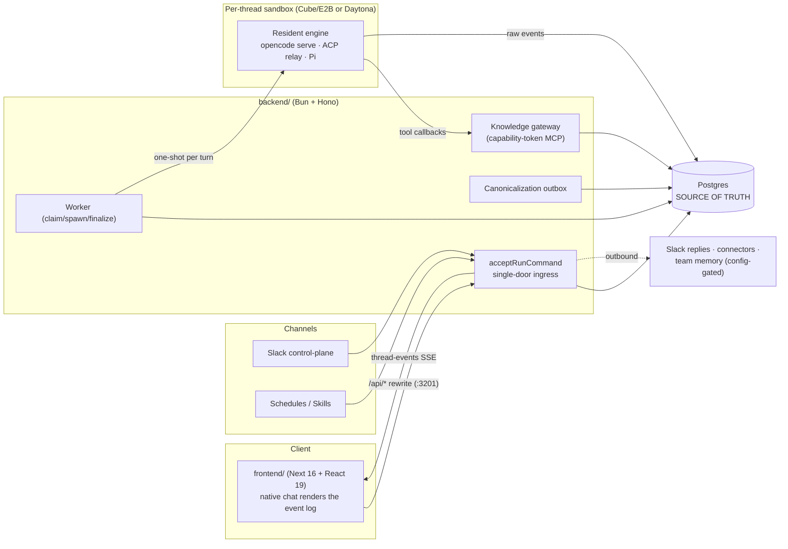
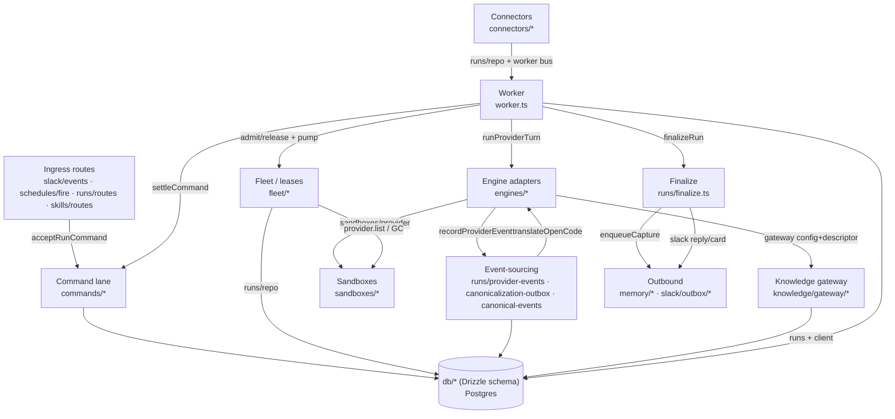
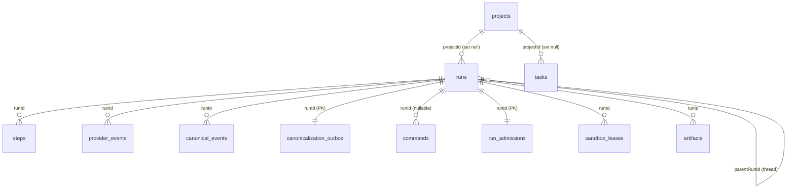

# useAgent - Architecture Graphs

The **map you look at**. Companion to [`ARCHITECTURE.md`](./ARCHITECTURE.md) (the map you read) and
the interactive [`codebase-map.html`](../../codebase-map.html) (repo root; isometric city map).

Every node/edge below corresponds to something real; the caption under each diagram cites the
`file:line` behind the non-obvious edges. Verified against **origin/main** (`c07d2f05`).
Flagged **UNVERIFIED** where not confirmed. Rewrite-on-change; re-verify `file:line` on edit.

> Note: `codebase-map.html` is the interactive visual companion generated by the `codebase-map`
> skill; it is **not committed in-repo at this commit** (see ARCHITECTURE.md Known gaps).

---

## A. System context



*Frontend `/api/*` rewrite `frontend/next.config.ts:60`; single door `acceptRunCommand`
`backend/src/commands/service.ts:194`; one-shot dispatch `backend/src/worker.ts:933`; tool
callbacks to gateway `backend/src/gateway-app.ts:12`; SSE `backend/src/runs/routes.ts:979`;
outbound memory config-gate `backend/src/env.ts:150`.*

---

## B. Subsystem dependency graph (import-backed)

Edges are real `import` statements between backend modules; the caption cites the importing file.



*Edge citations (importing file):*
- Ingress -> Command lane: `backend/src/slack/events.ts:26`, `backend/src/schedules/fire.ts:6`, `backend/src/runs/routes.ts:26`, `backend/src/skills/routes.ts:348`
- Command lane -> db: `backend/src/commands/dispatch.ts:2`
- Worker -> Command lane / Engines / Fleet / Finalize: `backend/src/worker.ts:35`, `:15`, `:36`+`:37`, `:32`
- Engines -> Sandboxes / Gateway / Event-sourcing: `backend/src/engines/opencode-server.ts:8`, `:32`+`:37`, `:13`
- Fleet -> Sandboxes / db(runs): `backend/src/fleet/reconciler.ts:5`, `backend/src/fleet/admission.ts:18`
- Event-sourcing -> Engines(translate) / provider-events: `backend/src/runs/canonicalization-outbox.ts:33`, `:32`
- Finalize -> Outbound (memory + slack): `backend/src/runs/finalize.ts:6`, `:10`
- Gateway -> db(runs): `backend/src/knowledge/gateway/run-authorization.ts:3`
- Connectors -> Worker bus + runs: `backend/src/connectors/runFeed.ts:11`, `:9`
- Everything -> db: the Drizzle schema barrel `backend/src/db/schema.ts:4` is the shared sink (Postgres is the source of truth).

Dependency direction is one-way toward `db`; the two cycles are intentional facades:
Worker<->Engines (worker dispatches, engines emit back through `runs/*`) and
Event-sourcing->Engines (canonicalization imports only the pure `translateOpenCode`/`canonicalEngine`
helpers `backend/src/engines/opencode-canonical.ts`, `engine-alias.ts`, not the adapters).

---

## C. Run lifecycle (sequence)

```mermaid
sequenceDiagram
  participant Ch as Channel (web/Slack/schedule)
  participant Acc as acceptRunCommand
  participant DB as Postgres (commands/runs)
  participant Wk as Worker
  participant Adm as Fleet admission
  participant Eng as Engine adapter (in sandbox)
  participant PE as provider_events
  participant Cx as Canonicalization outbox
  participant CE as canonical_events
  participant SSE as thread-events SSE

  Ch->>Acc: acceptRunCommand(input)
  Acc->>DB: commit command+run (idempotent by org,key)
  Acc-->>SSE: publishRunLifecycleChange("created")
  Wk->>DB: claimNextRun (advisory lock, CAS queued->dispatched)
  Wk->>Adm: admitClaimedRun (mint sandbox_lease)
  Wk->>DB: beginEngineRun (status=running, step 0)
  Wk->>Eng: runProviderTurn(engineId, ctx)  [one-shot per turn]
  loop streaming
    Eng->>PE: recordProviderEvent (raw, monotonic seq)
    PE-->>SSE: live native frame (persist-before-publish)
  end
  Eng-->>Wk: turn returns
  Wk->>DB: finalizeRun (terminal status; enqueue canonicalization + side-effects, 1 txn)
  Wk-->>SSE: publishRunLifecycleChange("settled")
  Wk->>DB: onRunSettled -> settleCommand + pumpThread(next)
  Cx->>PE: drainProviderEvents (seal) + sourceWatermark
  Cx->>CE: canonicalizeRun -> atomic replace (only if watermark stable)
  Cx-->>SSE: publish canonical rows + canonicalization-complete
  SSE-->>Ch: replay canonical thread + live tail
```

*accept `commands/service.ts:194`; claim `commands/dispatch.ts:51`; admit `fleet/admission.ts:43`;
begin `worker.ts:261`; dispatch `worker.ts:933`; capture `runs/provider-events.ts:119`; finalize
`runs/finalize.ts:149`; settle+pump `worker.ts:247`; canonicalize `runs/canonicalization-outbox.ts:160`;
SSE `runs/routes.ts:979`.*

---

## D. Data model (core relations)



*FK evidence: `steps.runId` `schema/runs.ts:150`; `provider_events.runId` `schema/provider-events.ts:15`;
`canonical_events.runId` `schema/canonical.ts:35`; `canonicalization_outbox.runId` (PK) `:70`;
`commands.runId` `schema/commands.ts:28`; `run_admissions.runId` `schema/fleet.ts:63`;
`sandbox_leases.runId` `:111`; `runs.parentRunId` (self-ref thread) `schema/runs.ts:58`;
`runs.projectId` `:46`; `tasks.projectId` `schema/tasks.ts:29`; `artifacts.runId` `schema/artifacts.ts:31`.*

**Project note (corrected):** the old "project is derived, not first-class" claim is **outdated** at
this commit. `projects` is a real, populated table (migration `0063_projects`) with real FKs from
`runs.projectId` (`schema/runs.ts:46`) and `tasks.projectId` (`schema/tasks.ts:29`), written by
`ensureProject` (`backend/src/runs/repo.ts:199`). What survives from the old finding: `tasks.projectKey`
is a **free string with no FK** (`schema/tasks.ts:33`, a denormalized mirror) and `runs.repo`/`runs.repos`
remain string "compatibility metadata, not identity" (`schema/runs.ts:44`). The FK is identity; the
strings are the derived/compat mirror.

---

## E. Engine capability matrix

Capabilities are a computed function (`sessionCapabilities(engine, res)` `backend/src/engines/capabilities.ts:25`),
not a static table; the UI reads the negotiated map and never checks a provider name. Values for a cold
session (`res={desktop:false, knowledgeTools:false}`); last column = any engine under the T3 canonical
runtime (`res.runtimeOrchestration:true`). Tests: `backend/src/engines/capabilities.test.ts`.

| Capability (`capabilities.ts` line) | opencode | claude | codex | pi | + T3 runtime |
|---|:--:|:--:|:--:|:--:|:--:|
| `streamingText` (`:36`) | Y | Y | Y | Y | Y |
| `toolProgress` (`:37`) | Y | Y | Y | Y | Y |
| `fileDiffs` (`:38`) | Y | N | N | N | Y |
| `commands` (`:39`) | Y | Y | Y | Y | Y |
| `directTerminal` (`:40`) | Y | Y | Y | Y | Y |
| `nativeChildProjection` (`:43`) | Y | N | N | Y | Y |
| `gatewayChildSessions` (`:45`) | =knowledgeTools | =knowledgeTools | =knowledgeTools | =knowledgeTools | Y iff knowledgeTools |
| `reasoning` (`:47`) | Y | N | N | Y | Y |
| `resume` (`:48`) | Y | Y | Y | Y | Y |
| `load` (`:49`) | Y | Y | Y | Y | Y |
| `stop` (`:50`) | Y | Y | Y | Y | Y |
| `plans` (`:52`) | Y | N | N | Y | Y |
| `usage` (`:53`) | Y | N | N | Y | Y |
| `modelSelection` (`:54`) | Y | N | Y | Y | (claude stays N) |
| `reconcile` (`:58`) | Y | N | N | N | Y |
| `close` (`:59`) | N | Y | Y | Y | N |
| `nativeEmbed` (`:60`) | Y | N | N | N | N |
| `approvals` (`:61`) | N | N | N | N | Y |
| `questions` (`:62`) | Y | N | N | N | Y |
| `desktop` (`:64`) | =res.desktop | =res.desktop | =res.desktop | =res.desktop | =res.desktop |
| `knowledgeTools` (`:65`) | =res.knowledgeTools | =res.knowledgeTools | =res.knowledgeTools | =res.knowledgeTools | =res.knowledgeTools |

*Registered engine ids `backend/src/engines/index.ts:158`; alias normalization (`daytona`->`opencode`,
`claude-sdk`->`claude`) `backend/src/engines/engine-alias.ts:8`. UNVERIFIED: whether `claude`'s
`modelSelection:false` under T3 is intentional (the T3 driver descriptor sets `model.selection:"per_turn"`
`backend/src/engines/t3-provider-driver.ts:166`).*

---

*Verified against origin/main `c07d2f05`. See [`ARCHITECTURE.md`](./ARCHITECTURE.md) for the prose,
subsystem detail, hard invariants, and the full Known-gaps/UNVERIFIED list.*
