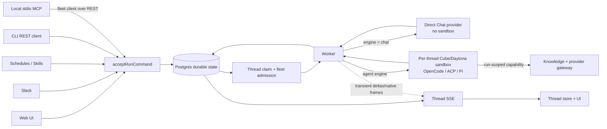
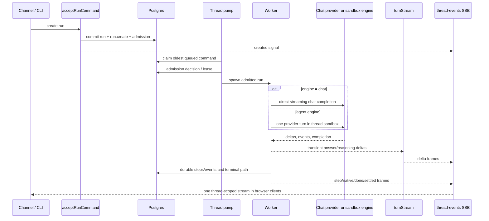
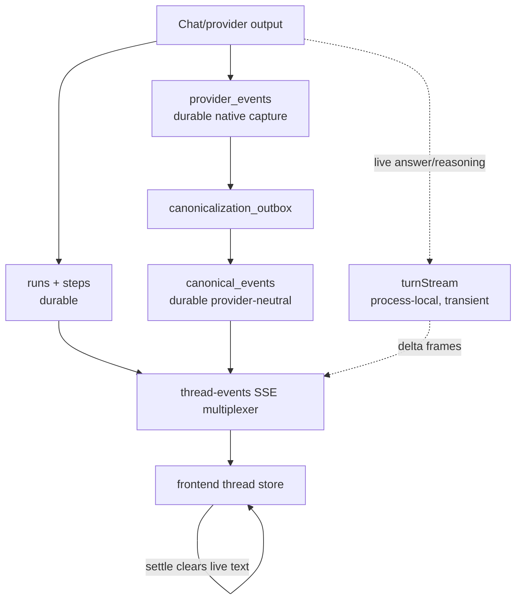
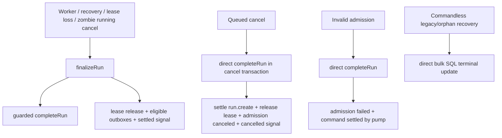
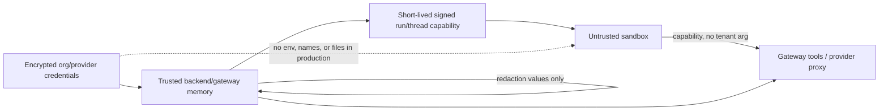
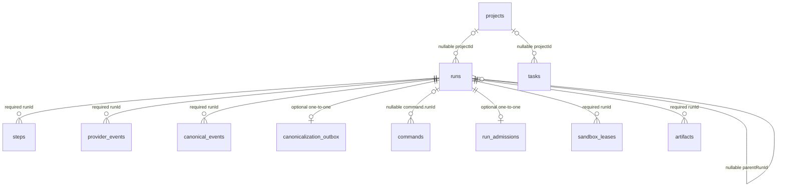
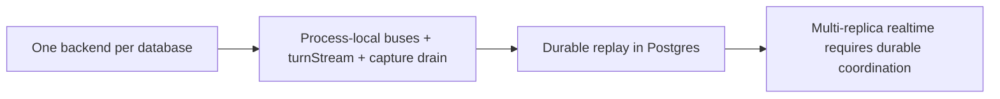

# useAgent architecture graphs

Diagram companion to [`docs/architecture/ARCHITECTURE.md`](./ARCHITECTURE.md), verified against the
`origin/main` base commit **`35ab7cd3`**. All paths are repository-root-relative.

## A. System context

Grounding: acceptance `backend/src/commands/service.ts:L81-L190`; CLI REST reuse
`packages/agent-client/src/fleet.ts:L1-L7`; local stdio MCP `packages/cli/src/mcp.ts:L211-L215`;
Chat branch `backend/src/worker.ts:L357-L366`; provider dispatch
`backend/src/engines/index.ts:L192-L216`; thread SSE `backend/src/runs/routes.ts:L954-L1000`.

## B. Run lifecycle and execution split

Grounding: atomic accept `backend/src/commands/repo.ts:L104-L129`; claim
`backend/src/commands/dispatch.ts:L45-L74`; fleet gate `backend/src/fleet/pump.ts:L16-L35`; Chat
execution `backend/src/worker.ts:L623-L745`; agent dispatch `backend/src/worker.ts:L927-L944`;
transient stream `backend/src/runs/turn-stream.ts:L1-L20`; SSE subscriptions
`backend/src/runs/routes.ts:L1048-L1070`.

## C. Durable and transient event lanes

Raw persistence/publication: `backend/src/runs/provider-events.ts:L119-L156`. Canonical sealing and
publication: `backend/src/runs/canonicalization-outbox.ts:L160-L202`. Transient buffering and
eviction: `backend/src/runs/turn-stream.ts:L54-L140`. Frontend clearing:
`frontend/components/chat/thread-store.ts:L327-L331`.

## D. Terminal-path matrix

Normal finalization: `backend/src/runs/finalize.ts:L140-L276`. Queued-cancel bypass:
`backend/src/commands/cancel.ts:L64-L123`. Invalid-admission bypass:
`backend/src/fleet/admission.ts:L93-L100`. Commandless-recovery bypass:
`backend/src/commands/dispatch.ts:L145-L160`.

## E. Production credential boundary

Production gateway-only mode: `backend/src/secrets/inject.ts:L128-L144` and
`backend/src/secrets/inject.ts:L238-L263`. No-op sandbox materialization:
`backend/src/secrets/inject.ts:L470-L480`. Token identity and expiry:
`backend/src/knowledge/gateway/token.ts:L35-L48`; live-run revalidation:
`backend/src/knowledge/gateway/run-authorization.ts:L40-L76`. Checked-in production selection:
`deploy/hetzner/configure-host.sh:L222-L243`.

## F. Core relations with nullability

FK/nullability evidence: `backend/src/db/schema/runs.ts:L42-L59`,
`backend/src/db/schema/runs.ts:L146-L162`, `backend/src/db/schema/provider-events.ts:L11-L37`,
`backend/src/db/schema/canonical.ts:L29-L83`, `backend/src/db/schema/commands.ts:L16-L29`,
`backend/src/db/schema/fleet.ts:L59-L65`, `backend/src/db/schema/fleet.ts:L107-L113`,
`backend/src/db/schema/tasks.ts:L24-L33`, `backend/src/db/schema/artifacts.ts:L25-L54`.

## G. Deployment constraint

The boot advisory lock and rationale are in `backend/src/db/single-backend.ts:L31-L43` and
`backend/src/db/single-backend.ts:L52-L88`. This is a checked-in deployment constraint, not a claim
that every local development process enables strict refusal.

---

Verified against `origin/main` base commit **`35ab7cd3`**.
